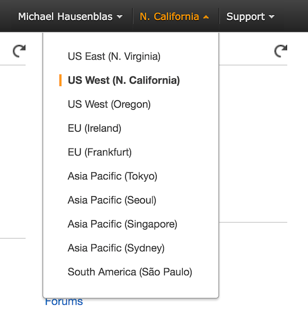
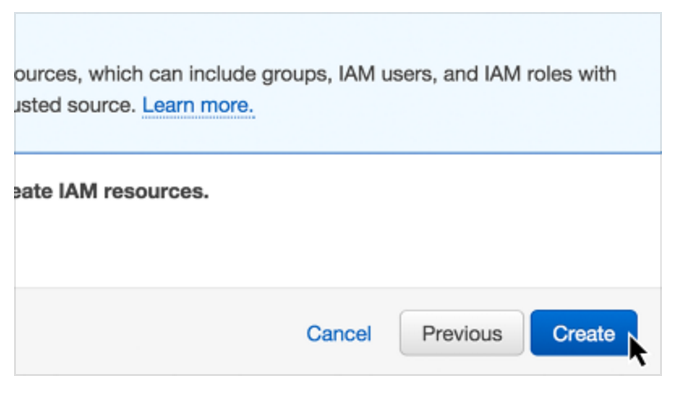
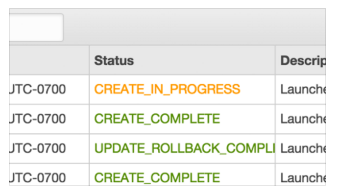

# Overview

This document explains how to install DC/OS via AWS.

# System requirements

## Hardware

In order to [use](/usage/) all of the services offered in DC/OS you should choose 

Selecting smaller-sized VMs is not recommended, and selecting fewer VMs will likely cause certain resource-intensive services such as distributed datastores not to work properly (from installation issues to operational limitations).

## Software

You will need an AWS account.

Also, in order to access nodes in the DC/OS cluster you will need `ssh` installed and configured.

# Install DC/OS

## Step 1: Creating a SSH key pair

The AWS key pair uses public-key cryptography to provide secure login to your AWS cluster. In order to create the key pair, go to [console.aws.amazon.com/ec2](https://console.aws.amazon.com/ec2/):

First, select your region; this should be the same region where you will create your cluster:

In the navigation pane, under `Network & Security`, click `Key Pairs` and then click the `Create Key Pair` button:

Save the `.pem` file locally for use later. Note that this is the only chance to save file!

## Step 2: Launching DC/OS cluster

First, select a launch region (the one you created the key pair in) and the preferred cluster configuration:

Launch stack (just click `Next`, nothing to change on this screen):

On the `Create stack` page, enter a name for your cluster, accept the EULA, select number of private Agents and click `Next`:

On the `Options` page, accept the defaults and click Next. On the Review page, check the acknowledgement box and click `Create`:

The stack spins up over a period of 10 to 15 minutes. The status changes from `CREATE_IN_PROGRESS` to `CREATE_COMPLETE`:

## Step 3: Accessing DC/OS

From the CloudFormation Management page, click on the `Outputs` tab and copy/paste the Mesos Master hostname into your browser:

# Next steps

- [Scaling considerations](https://aws.amazon.com/autoscaling/)
