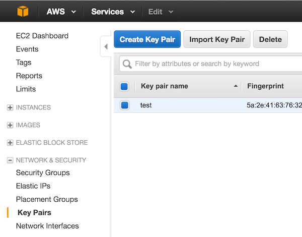
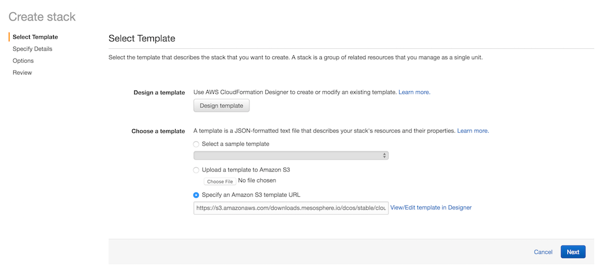
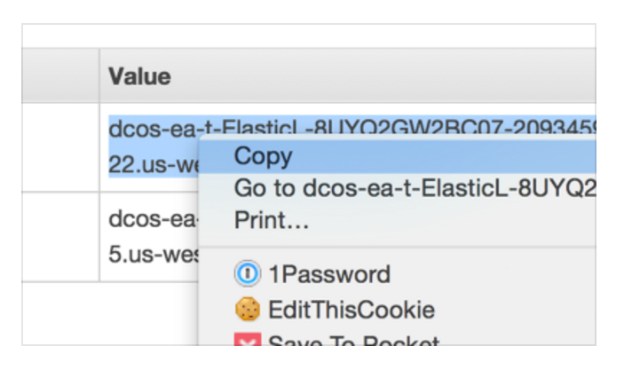

You can create a DC/OS cluster for Amazon Web Services (AWS) by using the DC/OS template on AWS CloudFormation.

Depending on the DC/OS services that you install, you might have to modify the DC/OS templates to suit your needs. For more information, see [Scaling the DC/OS cluster in AWS][1].

# System requirements

## Hardware

An Amazon EC2 <a href="https://aws.amazon.com/ec2/pricing/" target="_blank">m3.xlarge</a> instance.  Selecting smaller-sized VMs is not recommended, and selecting fewer VMs will likely cause certain resource-intensive services, such as distributed datastores, to not work properly.

## Software

- An AWS account.
- SSH installed and configured. This is required for accessing nodes in the DC/OS cluster.

# Install DC/OS

## Step 1: Creating a SSH key pair

The AWS key pair uses public-key cryptography to provide secure login to your AWS cluster. In order to create the key pair, go to [console.aws.amazon.com/ec2](https://console.aws.amazon.com/ec2/):

First, select your region; this should be the same region where you will create your cluster:

In the navigation pane, under `Network & Security`, click `Key Pairs` and then click the `Create Key Pair` button:

Save the `.pem` file locally for use later. Note that this is the only chance to save file!

## Step 2: Launching a DC/OS cluster

1.  Launch the <a href="https://downloads.dcos.io/dcos/EarlyAccess/aws.html" target="_blank">DC/OS template</a> on CloudFormation and select the region and number of masters. You must have a key pair for your selected region.

    **Important:** The DC/OS template is configured for running DC/OS. If you modify the template you might be unable to run certain packages on your DC/OS cluster.

    

2.  On the **Select Template** page, accept the defaults and click **Next**.

    

3.  On the **Specify Details** page, specify a cluster name (`Stack name
`), accept the EULA (AcceptEULA), SSH key (`KeyName`), the number of public (`PublicSlaveInstanceCount`) and private (`SlaveInstanceCount
`) agents and click **Next**. The other parameters are optional.

    Here is the recommended cluster configuration:
    *   5 Mesos private agent nodes
    *   1 Mesos public agent node

    

4.  On the **Options** page, accept the defaults and click **Next**.

    **Tip:** You can choose whether to rollback on failure. By default this option is set to **Yes**.

    

5.  On the **Review** page, check the acknowledgement box and then click **Create**.

    **Tip:** If the **Create New Stack** page is shown, either AWS is still processing your request or you’re looking at a different region. Navigate to the correct region and refresh the page to see your stack.

# Monitor the DC/OS cluster convergence process

In <a href="https://console.aws.amazon.com/cloudformation/home" target="_blank">CloudFormation</a> you should see:

*   The cluster stack spins up over a period of 10 to 15 minutes.

*   The status changes from CREATE_IN_PROGRESS to CREATE_COMPLETE.

**Troubleshooting:** A ROLLBACK_COMPLETE status means the deployment has failed. See the **Events** tab for useful information about failures.

# Launch DC/OS

Launch the DC/OS web interface by entering the Mesos Master hostname:

1.  From the <a href="https://console.aws.amazon.com/cloudformation/home" target="_blank">Amazon CloudFormation Management</a> page, click to check the box next to your stack.

2.  Click on the **Outputs** tab and copy/paste the Mesos Master hostname into your browser to open the DC/OS web interface. The interface runs on the standard HTTP port 80, so you do not need to specify a port number after the hostname.

    **Tip:** You might need to resize your window to see this tab. You can find your DC/OS hostname any time from the <a href="https://console.aws.amazon.com/cloudformation/home" target="_blank">Amazon CloudFormation Management</a> page.

    

# Next steps

- [Install the DC/OS Command-Line Interface (CLI)][2]
- [Using your cluster][3]
- [Scaling considerations][4]

 [1]: /docs/1.7/administration/managing-a-dcos-cluster-in-aws/
 [2]: /docs/1.7/usage/cli/install/
 [3]: /docs/1.7/usage/
 [4]: https://aws.amazon.com/autoscaling/
