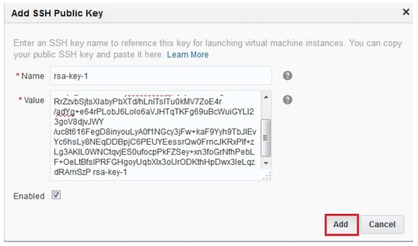
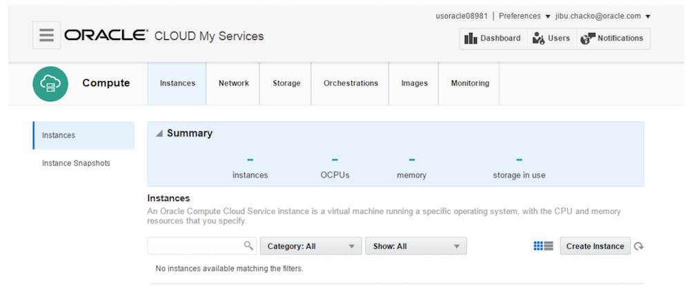
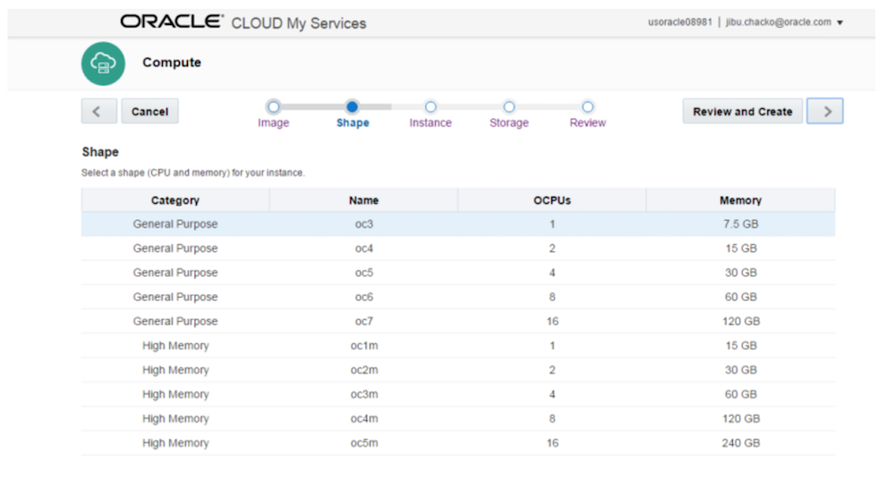
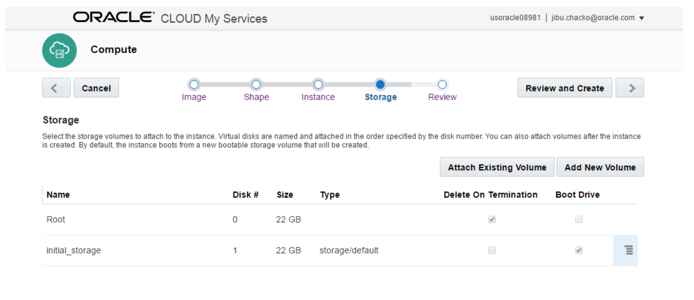
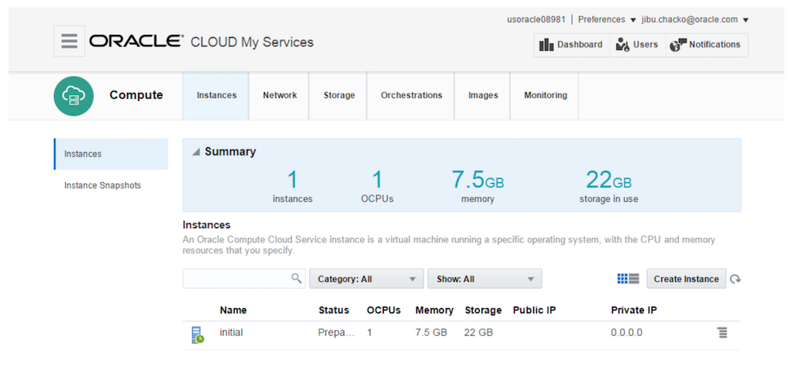
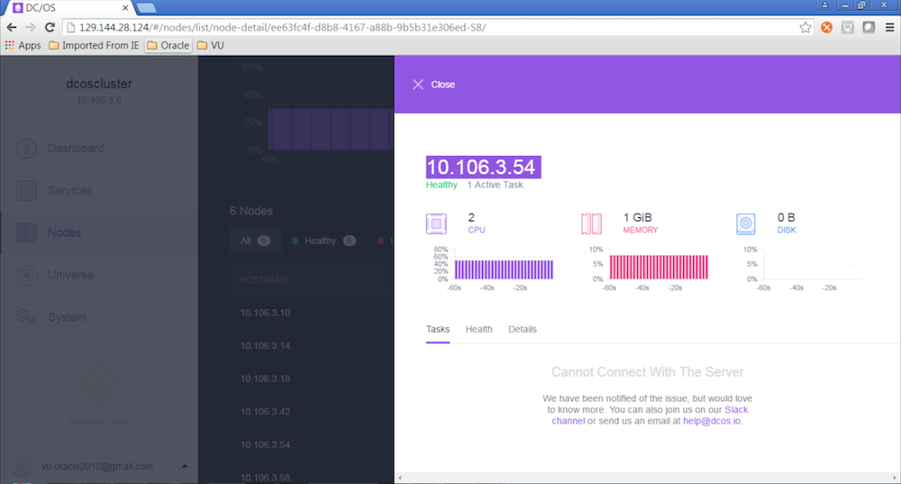

You can install DC/OS on Oracle Cloud Compute.

# Prerequisites

- You must be an Oracle Compute Cloud Service user with the `service-instance-name.Compute_Operations` role. For more information, see the Oracle Compute Cloud Service Roles [documentation](https://docs.oracle.com/cloud/latest/computecs_common/OCSUG/GUID-F89D66BD-85F5-4325-8A1F-F8EEE53A7CF1.htm).
- You must be able to log in to the web console of Oracle Compute Cloud Service. For more information, see the Accessing Oracle Compute Cloud Service Using the Web Console [documentation](http://www.oracle.com/pls/topic/lookup?ctx=stcomputecs&id=STCSG-GUID-D5D584FE-BE32-443D-9CB8-067AF73A15A6).
- The CentOS Linux 7 image (`tar.gz` file) that you are using must be available on the host that you are using to access the Oracle Compute Cloud Service web console.
- To obtain your REST endpoint, refer to the [REST API for Oracle Compute Cloud Service (IaaS)](https://docs.oracle.com/cloud/latest/stcomputecs/STCSA/SendRequests.html).

# System requirements

## Hardware

- A subscription to [Oracle Compute Cloud Services](https://cloud.oracle.com/en_US/compute?resolvetemplatefordevice=true).
- At least 14 OCPUs, 7 Persistent IPs (IP Reservations) and 210 GB of storage.

## Software

- Identify the REST endpoint.
- **Linux**: SSH installed.
- **Windows**: PuTTY and PuTTYGen.
- An SCP tool, for example, WinSCP.
- [CentOS Linux 7](http://cloud.centos.org/centos/7/images) Oracle Cloud Image. This tutorial is based on CentOS 7 Linux and before you begin you will need to download the image from CentOS website and upload it to Oracle Compute Cloud Service. Look for Oracle Cloud images at [http://cloud.centos.org/centos/7/images](http://cloud.centos.org/centos/7/images) and download locally. For example `CentOS-7-x86_64-OracleCloud.raw.tar.gz`.

  - You must have the required role to upload images to Oracle Storage Cloud Service. If this is the first machine image being uploaded to Oracle Storage Cloud Service, then you must have the `Storage Administrator` role. If one or more machine images have previously been uploaded to Oracle Storage Cloud Service, then any user with the `Storage_ReadWriteGroup` role can upload images.
  - Also, a replication policy must have been set for your Oracle Storage Cloud Service account and if a replication policy is already set, the `Set Replication Policy` link in `My Services` would be disabled.

# Prepare the environment

1. **Generate a SSH key pair** by following [this tutorial](http://www.oracle.com/pls/topic/lookup?ctx=stcomputecs&id=OCSUG149). **Do not** use a passphrase while generating the key pair because DC/OS doesn’t support encrypted SSH keys in this release.

2. **Upload the SSH Key to Oracle Compute**: [Sign in](https://cloud.oracle.com/sign_in) to the Oracle Cloud My Services application, go to the `Network` tab and select `SSH Public Keys` from the left-hand menu. Now click `Add SSH Public Key`.

  In the dialog box, enter a name and the value of the SSH public key that you generated, and then click `Add`. Note: Paste the key value exactly as it was generated. Don't append or insert any extra characters, line breaks, or spaces. Now your SSH public key is added to Oracle Compute Cloud Service:

  

3. Upload a CentOS7 image to the [Oracle Compute Cloud Service](http://www.oracle.com/pls/topic/lookup?ctx=stcomputecs&id=STCSG-GUID-799D6F6D-BDED-4DDE-9B3D-BE23BE5F687F). Note: while uploading the image file, you must specify a **unique name** for the target object, to differentiate the image that you're uploading from other images in Oracle Storage Cloud Service.

4. Register the image by following the instructions in [Registering a Machine Image in Oracle Compute Cloud Service](http://www.oracle.com/pls/topic/lookup?ctx=stcomputecs&id=STCSG-GUID-B41A8B96-7A71-42D6-8C6B-C6DB9D321F77).

# Spin up the bootstrap instance

1. Sign in to the Oracle Cloud My Services application at [https://myservices.us.oraclecloud.com/mycloud/faces/dashboard.jsp](https://myservices.us.oraclecloud.com/mycloud/faces/dashboard.jsp) and click on `Oracle Compute Cloud Service` -> `Open Service Console`. You will be shown the instance overview page.

  

2. Click on `Create Instance`.

3. Got to the `Private Images` tab and select the CentOS7 image you have registered and click `>`.

4. Select shape `oc3` and click `>`.

  

5. In the next screen provide the instance an appropriate label and name. Add `default` as security list. Select the pre-uploaded SSH keys and click `>`.

6. In the next `Volumes` screen leave the default values as it is and click `>`.

  

7. Review your settings and click on `Create`.

8. Now you should be able to see the instance spinning up.

  

9. Wait for the instance to reach `Running` status, which might take a few minutes.

# Start Oracle Compute orchestration

These steps assume that you've spun up the bootstrap instance and that you are logged into it.

1. Download and execute the generator script (`orchestration-generator.sh`):

  ```bash
  $ curl -O https://dcos.io/docs/1.7/administration/installing/cloud/oracle/orchestration-generator.sh
  $ ./orchestration-generator.sh
  ```

2. Enter below values when prompted:

  ```bash
  Your identity domain is usoracle08981
  Enter your user id and press [ENTER]: <your-user-id>
  Enter your password  and press [ENTER]: <your-password>
  Enter your REST Endpoint [Eg : https://api-z27.compute.us6.oraclecloud.com]: https://api-z27.compute.us6.oraclecloud.com
  Authenticating...
  Authentication Successful
  Enter the number of master nodes to be deployed and press [ENTER]: 3
  Enter the number of public nodes to be deployed and press [ENTER]: 3
  Enter the number of private nodes to be deployed and press [ENTER]: 3

  Select a shape you want to use

          oc3(1 CPU 7.5GB RAM)
          oc4(2 CPU 15GB RAM)
          oc5(4 CPU 30GB RAM)
          oc6(8 CPU 60GB RAM)
          oc7(16 CPU 120GB RAM)
          oc1m(1 CPU 15GB RAM)
          oc2m(2 CPU 30GB RAM)
          oc3m(4 CPU 60GB RAM)
          oc4m(8 CPU 120GB RAM)
          oc5m(16 CPU 240GB RAM)

  Enter shape type [Eg. oc3] oc4
  Enter the disk size to be assigned to the instances in GB and press [Eg. 10]: 30
  Available ssh keys
  1       /Compute-usoracle08981/ajay.seetharam@oracle.com/MasterMeso
  2       /Compute-usoracle08981/ajay.seetharam@oracle.com/MesoSSHPBK
  3       /Compute-usoracle08981/ajay.seetharam@oracle.com/bitnami-launchpad-rqcf1uk
  4       /Compute-usoracle08981/ajay.seetharam@oracle.com/jibu-test
  5       /Compute-usoracle08981/ajay.seetharam@oracle.com/meso0306
  6       /Compute-usoracle08981/ajay.seetharam@oracle.com/mesos-jibu-1905
  7       /Compute-usoracle08981/ajay.seetharam@oracle.com/mesos-ravi
  8       /Compute-usoracle08981/jibu.chacko@oracle.com/bash_dev
  9       /Compute-usoracle08981/upendra.vellanki@oracle.com/meso_wopp_vu
  Select the ssh key to be used [Eg 1]: <number-of-key-listed-above-to-use>
  Available Images
  1       /Compute-usoracle08981/ajay.seetharam@oracle.com/CentOS7
  2       /Compute-usoracle08981/anoop.srivastava@oracle.com/cloudboltAjay
  3       /Compute-usoracle08981/taylor@cloudbolt.io/CloudBolt-541
  4       /Compute-usoracle08981/taylor@cloudbolt.io/centos6
  Select the image to be used for instances [Eg 1]: 1
  Master nodes : 3 , Public Agent Nodes : 3 , Private Agent Nodes : 3 , Instances' size : 30
  SSH Key : /Compute-usoracle08981/upendra.vellanki@oracle.com/meso_wopp_vu
  Image used : /Compute-usoracle08981/ajay.seetharam@oracle.com/CentOS7
   Continue? [y/n]:y
  ```

3. The script generates the orchestration files, uploads them to Oracle Compute, and starts the orchestration process.

4. Finally, login into [https://computeui.us.oraclecloud.com/mycompute/faces/instances.jspx](https://computeui.us.oraclecloud.com/mycompute/faces/instances.jspx) and confirm that all instances have started.

# Install DC/OS

## Install Docker

1. Login to the bootstrap instance using the public IP.

2. Enable OverlayFS:

  ```bash
  $ sudo tee /etc/modules-load.d/overlay.conf <<EOF
  overlay
  EOF
  ```

3. Reboot instance to load new kernel module:

  ```bash
  $ sudo reboot
  ```

4. Wait for the instance to reboot and login again after reboot and then configure `yum` to add the Docker Repository:

  ```bash
  $ sudo tee /etc/yum.repos.d/docker.repo <<EOF
  [dockerrepo]
  name=Docker Repository
  baseurl=https://yum.dockerproject.org/repo/main/centos/$releasever/
  enabled=1
  gpgcheck=1
  gpgkey=https://yum.dockerproject.org/gpg
  EOF
  ```

5. Next, configure `systemd`:

  ```bash
  $ sudo mkdir -p /etc/systemd/system/docker.service.d && sudo tee /etc/systemd/system/docker.service.d/override.conf <<EOF
  [Service]
  ExecStart=
  ExecStart=/usr/bin/docker daemon --storage-driver=overlay -H fd://
  EOF
  ```

6. Install and launch the Docker engine:

  ```bash
  $ sudo yum install --assumeyes --tolerant docker-engine unzip ipset
  $ sudo systemctl start docker
  $ sudo systemctl enable docker
  ```

## Configure and install the DC/OS cluster

1. Create a directory named `genconf` on your bootstrap instance using `mkdir -p genconf` and create a configuration file `genconf/config.yaml` with the following content:

  ```yaml
  agent_list:
  - <agent-private-local-ip-1>
  - <agent-private-local-ip-2>
  - <agent-private-local-ip-3>
  - <agent-public-local-ip-1>
  - <agent-public-local-ip-2>
  - <agent-public-local-ip-3>
  bootstrap_url: file:///opt/dcos_install_tmp
  cluster_name: dcoscluster
  master_discovery: static
  master_list:
  - <master-local-ip-1>
  - <master-local-ip-2>
  - <master-local-ip-3>
  resolvers:
  - 8.8.4.4
  - 8.8.8.8
  SSH_port: 22
  SSH_user: centos
  ```

  Note:

  - Replace `<master-local-ip-1>`, `<master-local-ip-2>`, `<master-local-ip-3>` with the private IPs of your master nodes.
  - Replace `<agent-private-local-ip-1>`, `<agent-private-local-ip-2>`, `<agent-private-local-ip-3>` with the private IPs of your private nodes.
  - Replace `<agent-public-local-ip-1>`, `<agent-public-local-ip-2>`, `<agent-public-local-ip-3>` with the private IPs of your public nodes.

2. Execute below command to create the `ip-detect` script:

  ```bash
  $ cat > genconf/ip-detect <<EOF
  #!/bin/sh
  curl -fsSL http://169.254.169.254/latest/meta-data/local-ipv4
  EOF
  ```

3. Create a file for the private key using `touch genconf/dcos_private_key.ppk` and paste the content of the private key you generated in the very first step, Prepare the environment, into it.

4. Convert the private key to `openssh` format to use between the instances using:

  ```bash
  $ sudo docker run --rm --volume=/home/centos/dcos_private_key.ppk:/tmp/id.ppk --volume=/home/centos/:/tmp/out/ czerasz/putty-tools
  ```

5. Adapt the permissions and copy the generated key:

  ```bash
  $ sudo chown centos key && cp key genconf/SSH_key && chmod 0600 genconf/SSH_key
  ```

6. Download the DC/OS installer:

  ```bash
  $ curl -O https://downloads.dcos.io/dcos/EarlyAccess/commit/14509fe1e7899f439527fb39867194c7a425c771/dcos_generate_config.sh
  ```

7. Run the following command to generate your customized DC/OS build file:

  ```bash
  $ sudo bash dcos_generate_config.sh --genconf
  ```

8. Install prerequisites:

  ```bash
  $ sudo bash dcos_generate_config.sh --install-prereqs
  ```

9. Check if DC/OS is installable (checks if all dependencies are present):

  ```bash
  $ sudo bash dcos_generate_config.sh --preflight
  ```

10. If everything shows OK in the previous step, you can install DC/OS:

  ```bash
  $ sudo bash dcos_generate_config.sh--deploy
  ```

11. Check if the installation has completed as expected:

  ```bash
  $ sudo bash dcos_generate_config.sh --postflight
  ```

## Configure public node


1. Create a file `public-agents.txt` and add the private IPs of your public agents one per line, for example:

  ```bash
  10.106.7.162
  10.106.7.194
  10.106.7.170
  ```

2. Download and execute the public agent script (`install_public_slave.sh`) script:

  ```bash
  $ curl -O https://dcos.io/docs/1.7/administration/installing/cloud/oracle/install_public_slave.sh
  $ ./install_public_slave.sh
  ```

## Access the DC/OS Dashboard

If all goes well you can now access the [DC/OS Dashboard](/docs/1.7/usage/webinterface/) at `http://<public-ip-of-a-master-node>`:



# Next steps

- [Install the DC/OS Command-Line Interface (CLI)][1]
- [Add users to your cluster][2]
- [Use your cluster][3]

[1]: /docs/1.7/usage/cli/install/
[2]: /docs/1.7/administration/user-management/
[3]: /docs/1.7/usage/
[install_public_slave.sh]: /docs/1.7/administration/installing/cloud/oracle/install_public_slave.sh
[orchestration-generator.sh]: /docs/1.7/administration/installing/cloud/oracle/orchestration-generator.sh
