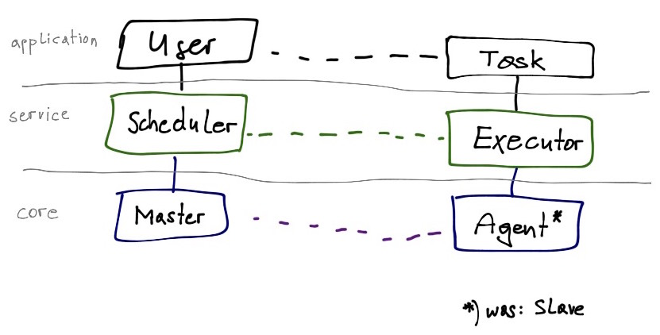
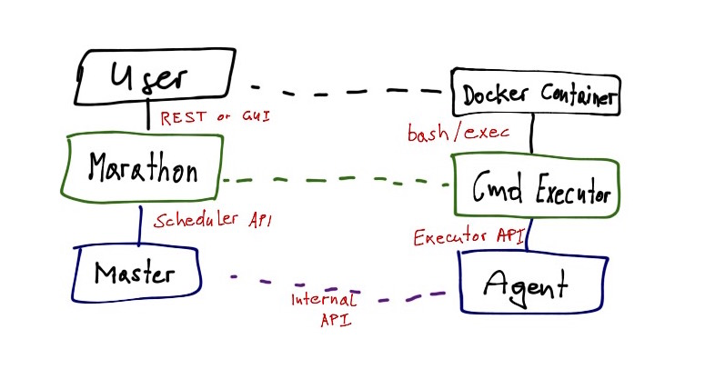

# The Architecture of DC/OS

An operating system abstracts resources such as CPU, RAM and networking and provides common services to applications. DC/OS is a distributed operating system that abstracts the resources of a cluster of machines and provides common services, such as running processes across a number of nodes, service discovery, and package management, just to name a few. In the following, we have a look at the architecture of DC/OS and the interaction of its components. 

## 100,000ft view

In DC/OS, the **kernel space** comprises Mesos Masters and Mesos Agents. System Services, such as Mesos-DNS or Spartan as well services like Marathon or Spark and processes managed by said services (for example a Marathon application) make up the **user space**.

Kernel space:

- One or more Mesos Masters. When a leading Mesos Master fails due to a crash or goes offline for an upgrade, a standby Mesos Master automatically becomes the leader without causing any disruption to running services. Leader election is performed via ZooKeeper.
- The `mesos-master` process on a Mesos Master orchestrates tasks that are run on Mesos Agents. The Mesos Master process receives resource offers from Mesos Agents and distributes those resources to registered DC.OS services, such as Marathon or Spark.
- There are two types of Mesos Agents: private agent nodes run the deployed apps and services. The optional public agent nodes can provide public access to DC/OS services and applications.
- The `mesos-slave` process on a Mesos Agent manages its local resources (CPU cores, RAM, etc.) and reports it to the Mesos Masters. It also accepts schedule requests from the Mesos Master and invokes an executor to launch a task.
  - The Mesos Containerizer provides lightweight containerization and resource isolation of executors using Linux-specific functionality such as cgroups and namespaces. For more information, see the [Mesos Containerizer][3] documentation.
  - The Mesos Docker Containerizer provides support for launching tasks that contain Docker images. For more information, see the [Docker Containerizer][4] documentation.

User space:

- System Services
  - [Admin router](https://github.com/mesosphere/adminrouter-public) is an open source NGNIX configuration that provides central authentication and proxy to DC/OS services within the cluster.
  - Exhibitor automatically configures your Zookeeper installation on the master nodes during installation.
  - Mesos-DNS provides service discovery within the cluster. Mesos DNS allows applications and services that are running on Mesos to find each other by using the domain name system (DNS), similar to how services discover each other throughout the Internet.
  - Minuteman-TBD
  - Spartan-TBD
  - System Marathon, the native Marathon instance that is the 'init system' for DC/OS, starts and monitors DC/OS services.
  - Zookeeper, a high-performance coordination service that manages the DC/OS services.
- Services
  - A service in DC/OS is technically a Mesos Framework (scheduler and executor)
  - User apps (for example a Marathon app)

## Boot sequence

In the following, we have a look at how a DC/OS cluster boots up, this means, we have a cluster of nodes with DC/OS installed and switch on the power. What happens?

### Master nodes

- Exhibitor starts up, creates ZK config, launches ZK
- Mesos Master are launched, looks at local ZK, discovers other Masters
- Mesos-DNS is launched on the master nodes
- Mesos-DNS keeps hitting `master/state.json` via leading Mesos Master
- Spartan (DNS proxy) runs on all nodes (master/agents) and forward to MesosDNS
- Marathon is launched
- Marathon goes to localhost for ZK, discovers leading Master
- Admin router depends on Master, MesosDNS and Spartan and runs on each of the master nodes (== DCOS UI)
- Auth is managed by OAuth (only masters)
- History services provides the data for the graphs in the UI (only masters)
- DCOS diagnostics (also systemd service, on every node)

### Agens nodes

- Mesos Agent starts up and discovers the leading Mesos Master via ZK
- Mesos Agent registers with the leading Mesos Master
- Mesos Master confirms and Mesos Agent starts sending status reports (what resources are available) to Mesos Master

### Services

For each service:

- Service scheduler starts up and discovers the leading Mesos Master via ZK
- Service scheduler registers with leading Mesos Master
- Mesos Master confirms and framework scheduler stores framework ID in ZK
- Once a service is registered the resource offer cycle between Mesos Master and framework scheduler kicks in (see also last section in this doc)

## Distributed process management

We now focus on the management of processes in a DC/OS cluster: from the resource allocation to the execution of a process.

Definitions:

Master: the leading Mesos Master
Agent: on each DC/OS worker node a Mesos Agent runs, managing the resources (CPU shares, RAM, etc.) locally. Note: originally this was called Mesos Slave and you might still see references to it in the codebase 
Process: a logical collection of tasks initiated by client, for example Marathon app or Chronos job
Executor: part of a Mesos framework, running on an Agent, managing one or more Mesos tasks
Task: Mesos task
Client (user): cluster-external or internal app that kicks off a process, for example a program that submits a Marathon app spec

Let’s now have a look at a concrete example using the Marathon framework and a user wanting to launch a container based on a Docker image:

On a high level, the interaction between above components looks as follows (note that Executors and Task are folded into one block since in practice this is often the case):

TBD: insert sequence diagram and detailed steps table here

