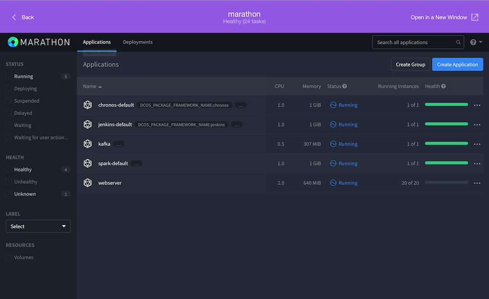

## The 30sec baby steps

You got installed DC/OS? You have the DC/OS command line interface (CLI) `dcos` on your local computer set up an now you're  looking at the DC/OS Dashboard wondering 'What now?'. You know how to use `docker run ...` to launch a webserver, right? Now you will do the same using DC/OS, with the difference that this deployment is production-ready from the get-go. DC/OS will keep the webserver running if it crashes, you can monitor it, scale it, update the config at runtime, and many more things but I'm getting ahead of myself now. Let's launch a production-ready containerized webserver:

Copy and paste the following into a file called `nginx.json`:

    {
        "id": "webserver",
        "cpus": 0.1,
        "mem": 32,
        "container": {
            "type": "DOCKER",
            "docker": {
                "image": "nginx:1.9",
                "network": "BRIDGE",
                "portMappings": [
                    {
                        "containerPort": 80,
                        "hostPort": 0
                    }
                ]
            }
        },
        "acceptedResourceRoles": [
            "slave_public"
        ]
    }

The above corresponds to `docker run --name webserver --net="bridge" --publish :80 nginx:1.9`, expressed in [Marathon's app specification](https://mesosphere.github.io/marathon/docs/application-basics.html) language, a JSON-formatted deployment descriptor for long-running DC/OS processes. 

Now, let's launch the webserver:

    $ dcos marathon app add nginx.json

If you now go to the DC/OS Dashboard and open the Marathon service you see the webserver up and running and ready to serve traffic:

## Next steps

### Basic

### Advanced

