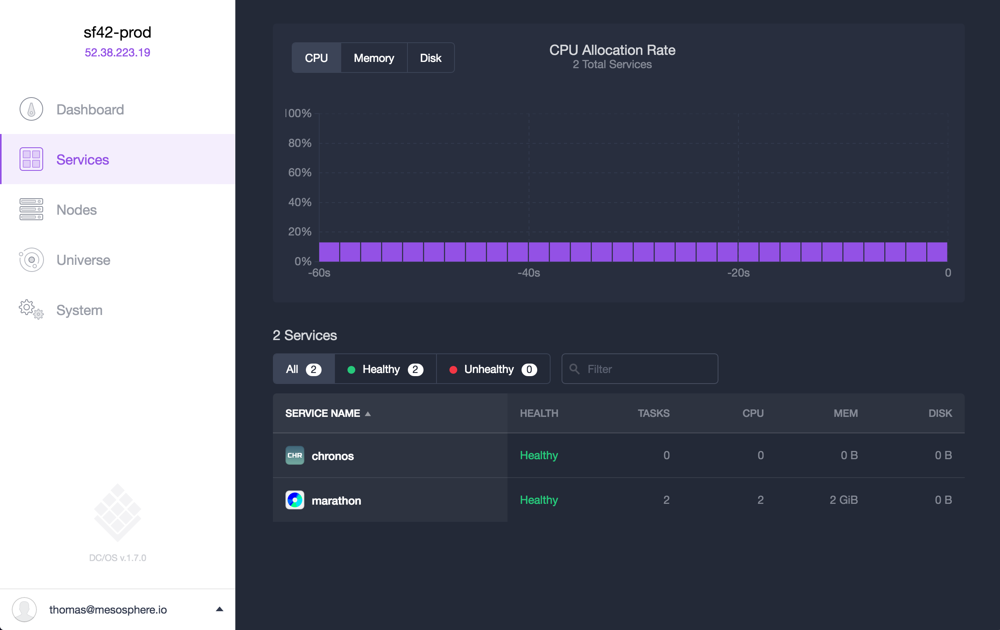

<!-- This source repo for this topic is https://github.com/dcos/dcos-docs -->

You can monitor the installed DC/OS services and their health through the DC/OS web interface or command line interface.

**Prerequisites:**

*   [DC/OS cluster][1] is up and running.
*   [DC/OS CLI][2] is installed and configured.

# Viewing DC/OS services 

## Web interface 
From the DC/OS web interface, click the **Services** tab. In this example you can see the installed DC/OS services Cassandra, Chronos, and HDFS. All of the services are showing a status of Healthy.



*   **SERVICE NAME** Displays the DC/OS service name.
*   **HEALTH** Displays the [Marathon health check][3] status for the service.
*   **TASKS** Display the number of running tasks.
*   **CPU** Displays the percentage of CPU in use.
*   **MEM** Displays the amount of memory used.
*   **DISK** Displays the amount of disk space used.

For more information about the Services tab, see the web interface services [documentation][4].

## CLI
From the DC/OS CLI, enter the `dcos service` command. In this example you can see the native Marathon instance, and the installed DC/OS services Chronos, HDFS, and Kafka.

```bash
$ dcos service
NAME      HOST             ACTIVE  TASKS CPU   MEM     DISK   ID
chronos   <privatenode1>   True     0    0.0    0.0     0.0   <service-id1>
hdfs      <privatenode2>   True     1    0.35  1036.8   0.0   <service-id2>
kafka     <privatenode3>   True     0    0.0    0.0     0.0   <service-id3>
marathon  <privatenode3>   True     3    2.0   1843.0  100.0  <service-id4>
```

*   **NAME** Displays the DC/OS service name.
*   **HOST** Displays the private agent node where the service running.
*   **ACTIVE** Indicates whether the service is connected to a scheduler.
*   **TASK** Displays the number of running tasks.
*   **CPU** Displays the percentage of CPU in use.
*   **MEM** Displays the amount of memory used.
*   **DISK** Displays the amount of disk space used.
*   **ID** Displays the DC/OS service framework ID. This value is automatically generated and is unique across the cluster.

For more information, see the dcos service [command reference][8].

# Viewing DC/OS nodes 

## Web interface
From the DC/OS web interface, click the **Nodes** tab. The Nodes page provides a comprehensive view of all of the nodes that are used across your cluster. You can view a graph that shows the allocation percentage rate for CPU, memory, or disk.

![UI nodes view][5]

For more information, see the web interface nodes [documentation][6].

## CLI
From the DC/OS CLI, enter the `dcos node` command to see a list of cluster nodes. 

```bash
$ dcos node
 HOSTNAME       IP                         ID                    
10.0.0.157  10.0.0.157  b29f8fc6-bb08-4265-8cb2-9f5499167363-S0  
10.0.4.34   10.0.4.34   b29f8fc6-bb08-4265-8cb2-9f5499167363-S1 
```

For more information, see the dcos node [command reference][7].


 [1]: /docs/1.7/administration/installing/
 [2]: /docs/1.7/usage/cli/install/
 [3]: https://mesosphere.github.io/marathon/docs/health-checks.html
 [4]: /docs/1.7/usage/webinterface/#services
 [4]: /docs/1.7/usage/webinterface/#services
 [5]: /docs/1.7/usage/img/dcos-nodes-1.7.png
 [6]: /docs/1.7/usage/webinterface/#nodes
 [7]: /docs/1.7/usage/cli/command-reference/#dcosnode
 [8]: /docs/1.7/usage/cli/command-reference/#dcosservice
