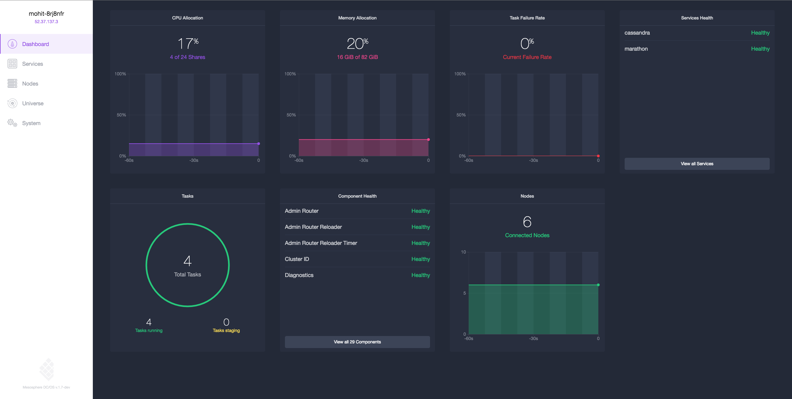

[Apache Cassandra](https://cassandra.apache.org/) is a decentralized structured distributed storage system. Cassandra clusters are highly available, scalable, performant, and fault tolerant. DC/OS Cassandra allows you to quickly configure, install, and manage Apache Cassandra. Multiple Cassandra clusters can also be installed on DC/OS and managed independently, so you can offer Cassandra as a managed service to your organization.

**Terminology**:

- **Node**: A running Cassandra instance.
- **Cluster**: Two or more Cassandra instances that communicate over gossip protocol.
- **Keyspace**: A namespace that defines how data is replicated on nodes.

**Scope**:

In this tutorial you will learn how to:

- Install the Cassandra service.
- Use the enhanced DC/OS CLI operations for Cassandra.
- Validate that the service is up and running.
- Connect to Cassandra and perform CRUD operations.

**Table of Contents**:

- [Prerequisites](#prerequisites)
- [Installing Cassandra](#installing-cassandra)
  - [Typical installation](#typical-installation)
  - [Custom manual installation procedure](#custom-manual-installation-procedure)
  - [Manual installation via the web interface](#manual-installation-via-the-web-interface)
  - [Validate installation](#validate-installation)
- [Cassandra CRUD operations](#cassandra-crud-operations)
- [Cleanup](#cleanup)

## Prerequisites

- A running DC/OS cluster with three nodes, each with 2 CPUs and 2 GB of RAM available.
- [DC/OS CLI](/docs/1.7/usage/cli/install/) installed.

## Installing Cassandra

Assuming you have a DC/OS cluster up and running, the first step is to [install Cassandra](/docs/1.8/usage/managing-services/install/)

### Typical installation

Install Cassandra using the DC/OS CLI:

```bash
$ dcos package install cassandra
Installing Marathon app for package [cassandra] version [1.0.0-2.2.5]
Installing CLI subcommand for package [cassandra] version [1.0.0-2.2.5]
New command available: dcos cassandra
DC/OS Cassandra Service is being installed.
```

While the DC/OS command line interface (CLI) is immediately available, it takes a few moments for Cassandra to start running in the cluster.

### Custom manual installation procedure

1. Verify existing DC/OS repositories:

    ```bash
    $ dcos package repo list
    Universe: https://universe.mesosphere.com/repo
    ```

1. Identify available versions for the Cassandra service.

    You can either list all available versions for Cassandra:

    ```bash
    $ dcos package list cassandra
    ```

    Or you can search for a particular one:

    ```bash
    $ dcos package search cassandra
    ```

1. Install a specific version of the Cassandra package:

    ```bash
    $ dcos package install --yes --force --package-version=<package_version> Cassandra
    ```

### Manual installation via the web interface

You can also install the Cassandra service from DC/OS Universe via `http://<dcos-master-dns>/#/universe/packages/`.

### Validate installation

Validate that the installation added the enhanced DC/OS CLI for Cassandra:

```bash
$ dcos cassandra --help
Usage: dcos-cassandra cassandra [OPTIONS] COMMAND [ARGS]...

Options:
  --info / --no-info
  --name TEXT         Name of the Cassandra instance to query.
  --config-schema     Prints the config schema for Cassandra.
  --help              Show this message and exit.

Commands:
  backup      Backup Cassandra data
  cleanup     Cleanup old token mappings
  connection  Provides connection information
  node        Manage Cassandra nodes
  repair      Perform primary range repair.
  restore     Restore Cassandra cluster from backup
  seeds       Retrieve seed node information
```

Go to the DC/OS dashboard to validate that the Cassandra service is running and healthy:



## Perform Cassandra CRUD operations

Retrieve the connection information:

```bash
$ dcos cassandra connection
{
    "address": [
        "10.0.2.66:9042",
        "10.0.2.65:9042",
        "10.0.2.64:9042"
    ],
    "dns": [
        "node-1.cassandra.mesos:9042",
        "node-2.cassandra.mesos:9042",
        "node-3.cassandra.mesos:9042"
    ]
}
```

SSH into your DC/OS cluster to connect to your Cassandra cluster:

```
$ dcos node ssh --master-proxy --leader
core@ip-10-0-6-153 ~ $
```

You are now inside your DC/OS cluster and can connect to the Cassandra cluster directly. Connect to the cluster using the cqlsh client:

```bash
core@ip-10-0-6-153 ~ $ docker run cassandra:2.2.5 cqlsh <HOST>
```

Replace `<HOST>` with the actual host, which that we retrieved by running `dcos cassandra connection`, above:

```bash
core@ip-10-0-6-153 ~ $ docker run -ti cassandra:2.2.5 cqlsh 10.0.2.66
cqlsh>
```

You are now connected to your Cassandra cluster. Let's create a sample keyspace called `demo`:

```sql
cqlsh> CREATE KEYSPACE demo WITH REPLICATION = { 'class' : 'SimpleStrategy', 'replication_factor' : 3 };
```

Next, create a sample table called `map` in the `demo` keyspace:

```sql
cqlsh> CREATE TABLE demo.map (key varchar, value varchar, PRIMARY KEY(key));
```

Insert some data in your table:

```sql
cqlsh> INSERT INTO demo.map(key, value) VALUES('Cassandra', 'Rocks!');
cqlsh> INSERT INTO demo.map(key, value) VALUES('StaticInfrastructure', 'BeGone!');
cqlsh> INSERT INTO demo.map(key, value) VALUES('Buzz', 'DC/OS is the new black!');
```

Query the data back to make sure it's persisted correctly:

```sql
cqlsh> SELECT * FROM demo.map;
```

Delete data:

```sql
cqlsh> DELETE FROM demo.map where key = 'StaticInfrastructure';
```

Query again to ensure that the row was deleted successfully:

```sql
cqlsh> SELECT * FROM demo.map;
```

## Cleanup

### Uninstalling

```bash
$ dcos package uninstall cassandra
```

Use the [framework cleaner](/docs/1.7/usage/managing-services/uninstall/#framework-cleaner) script to remove your Cassandra instance from Zookeeper and to destroy all data associated with it. The script requires several arguments, the values for which are derived from your service name:

`framework-role` is `cassandra_role`
`framework-principal` is `cassandra_principal`
`zk_path` is `cassandra`

**Further resources**

1. [DC/OS Cassandra Official Documentation](https://docs.mesosphere.com/usage/services/cassandra/)
1. [DataStax Cassandra Documentation](http://docs.datastax.com)
