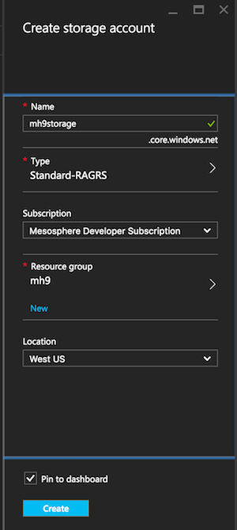
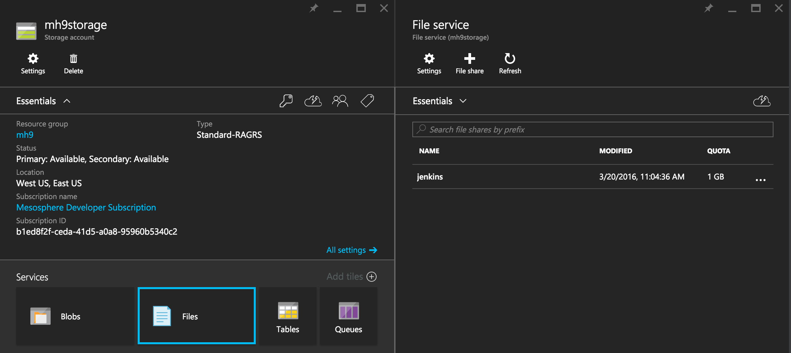
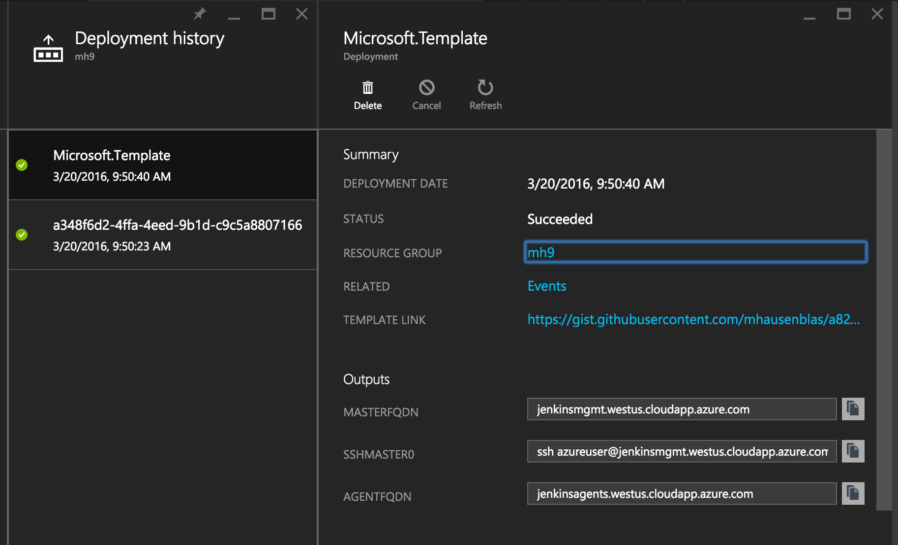
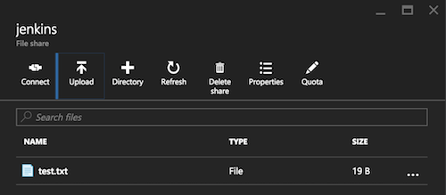
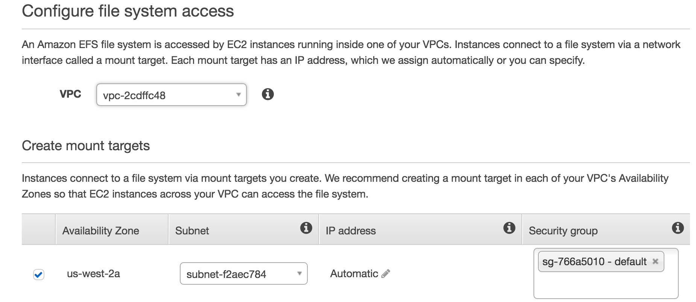
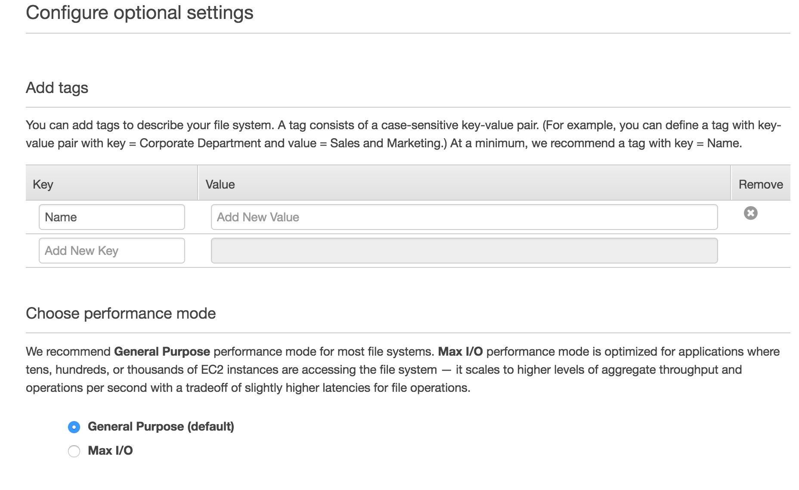
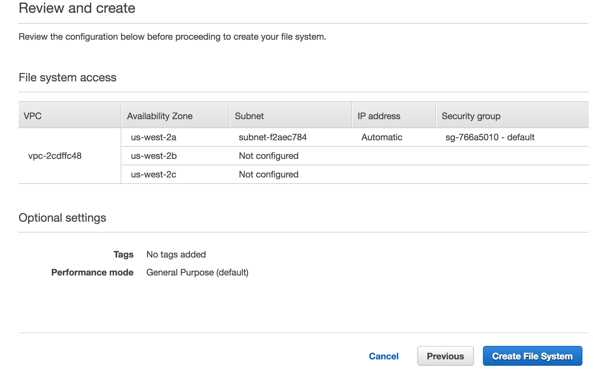
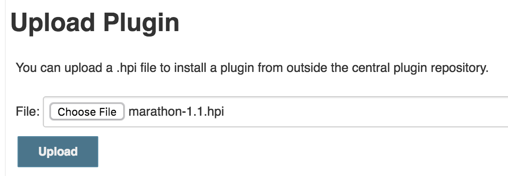
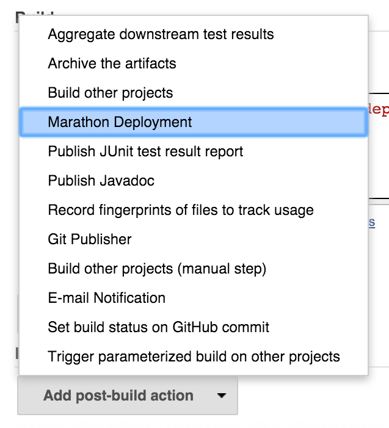

[Jenkins][jenkins-website] is a popular, open source continuous integration
(CI) automation server and framework with hundreds of plugins (GitHub, Docker,
Slack, etc) available. Running Jenkins on DC/OS allows you to scale your CI
infrastructure by dynamically creating and destroying Jenkins agents as demand
increases or decreases, and enables you to avoid the statically partitioned
infrastructure typical of a traditional Jenkins deployment.

### Time Estimate

Varies (up to 45 minutes)

### Target Audiences

Operators, Application administrators, Quality / Release engineers, CI/CD
administrators

### Scope

In the following tutorial, you'll learn about how to use Jenkins on DC/OS.
You'll learn how to install Jenkins, and then how to use it to build and deploy
a Docker image on Marathon.

### Table of Contents

  * Prerequisites
  * Installing Jenkins in a development environment
  * Installing Jenkins in production
    * Creating a CIFS file share on Microsoft Azure
    * Mounting an Azure CIFS file share on Debian
    * Creating a NFS file share with Amazon EFS
    * Mounting an NFS file share on CoreOS
  * Building a Docker image and deploying it to Marathon
  * Uninstalling Jenkins
  * Further reading

## Preparation

Assuming you already have a DC/OS cluster up and running, you'll first want to
[install a user-specific Marathon instance][marathon-service-docs]. This will
serve as the deployment platform for any user-created applications that are
deployed by Jenkins.

```bash
dcos package install marathon
We recommend a minimum of one node with at least 2 CPU shares and 1GB of RAM
available for the Marathon DC/OS Service.
Continue installing? [yes/no] yes
Installing Marathon app for package [marathon] version [1.1.1]
Marathon DC/OS Service has been successfully installed!

    Documentation: https://mesosphere.github.io/marathon
    Issues: https:/github.com/mesosphere/marathon/issue
```

This Marathon instance will appear in the DC/OS dashboard as `marathon-user`.

Jenkins works by persisting information about its configuration and build
history as files on disk. Therefore, we have two options for deploying
Jenkins on DC/OS: pin it to a single node, or use a network file system such
as NFS, CIFS, and so on.

## Installing Jenkins in a development environment

If you only want to run Jenkins in a development environment, it's trivial
to pin it to a single agent in the DC/OS cluster. Create the file
`options.json` with the configuration below, modifying `pinned-hostname`
to correspond to an agent IP in your DC/OS cluster:

```bash
cat options.json
{
    "storage": {
        "pinned-hostname": "10.100.100.88"
    }
}
```

*Tip: for a complete list of the configuration options available for the
Jenkins package, see the [Jenkins package definition in the Mesosphere
Universe][mesosphere-universe-jenkins].*

Once you create `options.json`, you can then install Jenkins by running the
following command:

```bash
dcos package install jenkins --options=options.json
```

Once ready, Jenkins will appear as a service in the DC/OS dashboard.

## Installing Jenkins in production

As mentioned previously, running Jenkins in a production environment will
require that each machine in the cluster has an external volume mounted at the
same location. This external volume can be backed by any number of systems,
including NFS, CIFS, Ceph, and others. This will allow Jenkins to persist data
to the external volume while still being able to run on any agent in the
cluster, preventing against outages due to machine failure.

If you already have a mount point, great! Create an `options.json` file that
resembles the following example:

```bash
cat options.json
{
    "service": {
        "name": "jenkins-prod",
        "cpus": 2.0,
        "mem": 4096
    },
    "storage": {
        "host-volume": "/mnt/jenkins"
    }
}
```

Then, install Jenkins by running the following command:

```bash
dcos package install jenkins --options=options.json
```

If you don't have a file share set up and are looking for a solution, continue
to the next section for instructions on how to set up a shares using
CIFS on Microsoft Azure or NFS on Amazon EFS.

### Creating a CIFS file share on Microsoft Azure

First, you need to create a [Storage Account][azure-storage-account] in the
same resource group in which you've launched your DC/OS cluster.

In this particular example, let's create the storage account `mh9storage` in
the resource group `mh9`:



Now, create a file share. In this example, I used `jenkins`:



### Mounting an Azure CIFS file share on Debian

Next, login to the DC/OS master node. To determine the master, look up the SSH
connection string labeled `SSHMASTER0` in the `Outputs` section of the
`Microsoft.Template`.



Next, add the private SSH key locally:

```bash
ssh-add ~/.ssh/azure
Identity added: /Users/mhausenblas/.ssh/azure (/Users/mhausenblas/.ssh/azure)
```

And now, login to the master node. Note that the `-L 8000:localhost:80` is
forwarding port 8000 from your local machine to port 80 on the remote host.

```bash
ssh azureuser@jenkinsmgmt.westus.cloudapp.azure.com -A -p 2200 \
    -L 8000:localhost:80
```

On this node you can now [mount the File Share][mount-file-share-azure] we
created in the previous step. First, let's make 100% sure that the CIFS mount
utils are available:

```bash
sudo apt-get update && sudo apt-get -y install cifs-utils
```

Now we can mount the file share:

```bash
azureuser@dcos-master-415F65E0-0:~sudo mkdir -p /mnt/jenkins
azureuser@dcos-master-415F65E0-0:~sudo mount -t cifs    \
  //mh9storage.file.core.windows.net/jenkins /mnt/jenkins \
  -o vers=3.0,username=REDACTED,password=REDACTED,dir_mode=0777,file_mode=0777
```

Be sure to replace the `REDACTED` value for the `username` and `password`
options with your username and password. Note that the value for `password` is
`KEY2` from `Access keys`, as shown here:


To check if the file share works, we upload a test file via the Azure portal:



If all is well, you should be able to list the contents of the mounted file
share on the DC/OS master node:

```bash
azureuser@dcos-master-415F65E0-0:~ls -al /mnt/jenkins
total 1
-rwxrwxrwx 1 root root 19 Mar 20 11:21 test.txt
```

Finally, using the pssh tool, configure each of the DC/OS agents to mount the file share.

```bash
sudo apt-get install pssh
cat pssh_agents
10.0.0.4
10.0.0.5
10.32.0.4

parallel-ssh -O StrictHostKeyChecking=no -l azureuser -h pssh_agents "if [ ! -d "/mnt/jenkins" ]; then mkdir -p "/mnt/jenkins" ; fi"
parallel-ssh -O StrictHostKeyChecking=no -l azureuser -h pssh_agents "mount -t cifs //mh9storage.file.core.windows.net/jenkins /mnt/jenkins -o vers=3.0,username=REDACTED,password=REDACTED,dir_mode=0777,file_mode=0777"
```

### Creating an NFS file share with Amazon EFS

To start, open the [Amazon EFS console][amazon-efs-console], click
`Create file system` and then `Create file system`. Ensure you are in the
same availability zone as as your DC/OS cluster.

Select the VPC of your DC/OS cluster and click `Next Step`:



Optional settings can be left blank, or you can add tags to the volume if
desired.  Click `Next Step`:



You will see a "Review and create" screen. Double check that the
appropriate availability zone is selected, then click `Create File System`:



Once your EFS volume has been created, Amazon provides a link (click `here`)
on instructions for mounting on Amazon, Red Hat, and SuSE Linux:


See below for instructions on mounting an NFS volume on CoreOS.

### Mounting an NFS file share on CoreOS

First, get the link to the EFS NFS fileshare you created in the previous
step, replacing `xxxxxxxx` with your unique EFS ID:

```bash
echo $(curl -s http://169.254.169.254/latest/meta-data/placement/availability-zone).fs-xxxxxxxx.efs.us-west-2.amazonaws.com:/
```

Next, follow our [documentation for mounting NFS volumes][dcos-nfs-docs] to
mount your EFS NFS filesystem on each of your DC/OS agents.

## Building a Docker image and deploying it to Marathon

*Note: for this example, I'll assume you already have your own Docker Hub
account or access to a Docker image registry.*

By default, the Jenkins package is configured with a Docker-in-Docker agent
that allows you to build Docker images on top of DC/OS. Nothing else is needed
on your part!

Mesosphere maintains an open source Marathon plugin for Jenkins, which allows
you to easily deploy an application to Marathon. To install it, perform the
following steps:

  1. Download the .hpi file for the latest Marathon plugin here:
  https://github.com/mesosphere/jenkins-marathon-plugin/releases
  2. Upload the `.hpi` plugin file via the "Advanced" tab within the Jenkins
  plugin manager:
  
  3. Restart Jenkins to load the new plugin.

Next, you'll configure a Jenkins job that clones a repository, builds the
image, pushes it to Docker Hub, and deploys it to Marathon.


For the build step, you may use (or adapt) the following build script:

```bash
#!/bin/bash
IMAGE_NAME="${DOCKER_USERNAME}/${JOB_NAME}:${GIT_COMMIT}"

docker login -u ${DOCKER_USERNAME} -p ${DOCKER_PASSWORD} -e ${DOCKER_EMAIL}
docker build -t $IMAGE_NAME .
docker push $IMAGE_NAME
```

Finally, configure a post-build step using the Marathon plugin:



An example of a Marathon deployment follows:


## Uninstalling Jenkins

Using the DC/OS CLI, run the following command:

```
dcos package uninstall jenkins
```

## Further Reading

  * [Jenkins project website][jenkins-website] (jenkins-ci.org)
  * [Jenkins service documentation][jenkins-service-docs] (mesosphere.com)
  * [Marathon service documentation](https://docs.mesosphere.com/1.7/usage/service-guides/marathon/) (mesosphere.com)
  * [Mesos plugin for Jenkins][jenkins-mesos-plugin] (github.com)

[amazon-efs-console]: https://console.aws.amazon.com/efs/
[azure-storage-account]: https://portal.azure.com/#create/Microsoft.StorageAccount-ARM
[dcos-nfs-docs]: /docs/1.7/administration/storage/nfs/
[jenkins-mesos-plugin]: https://github.com/jenkinsci/mesos-plugin
[jenkins-service-docs]: https://docs.mesosphere.com/1.7/usage/service-guides/jenkins/
[jenkins-website]: https://jenkins-ci.org
[marathon-service-docs]: /docs/1.7/usage/managing-services/install/
[mesosphere-universe-jenkins]: https://github.com/mesosphere/universe/tree/version-2.x/repo/packages/J/jenkins
[mount-file-share-azure]: https://azure.microsoft.com/en-us/documentation/articles/storage-how-to-use-files-linux/
