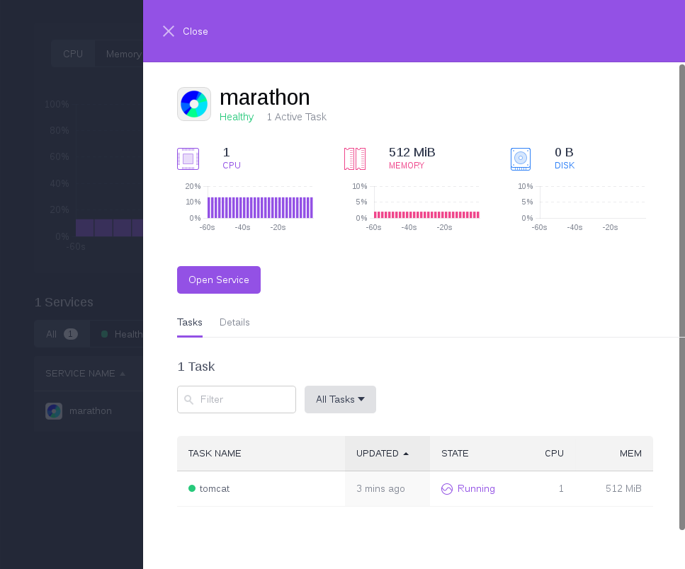
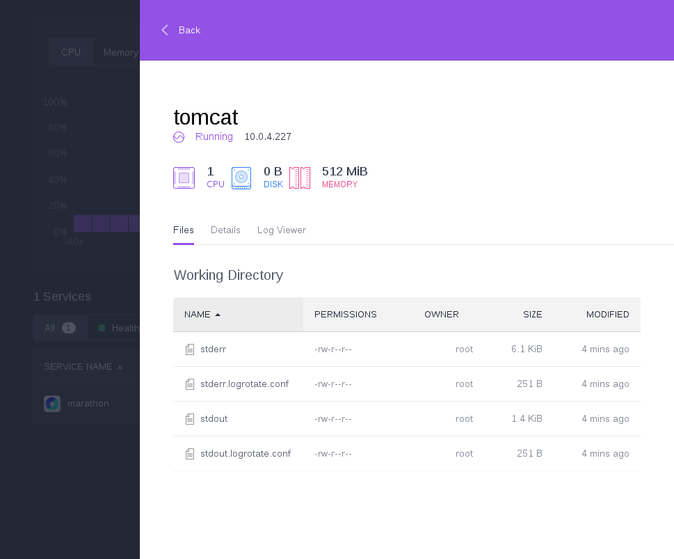

[Apache Tomcat](http://tomcat.apache.org/index.html) provides implementations of Servlet, JSP, EL and WebSocket from the Java EE Web Application Container specification.

**Prerequisites**

- A DC/OS cluster with at least 1 master and 1 [public agent](/docs/1.7/overview/concepts/#public) node
- DC/OS [CLI](/docs/1.7/usage/cli/) 0.4.6 or later
- [jQuery](https://github.com/stedolan/jq/wiki/Installation)
- [SSH](/docs/1.7/administration/sshcluster/) configured

## Run the container

Download the Tomcat `marathon.json` app definition file to your local host where the DC/OS CLI is installed. 

```
curl -O https://dcos.io/docs/1.7/usage/tutorials/tomcat/marathon.json
```

Lets inspect the `marathon.json` file:

```
cat marathon.json
```

It should look like this:

```json
{
  "id": "/tomcat",
  "instances": 1,
  "cpus": 1,
  "mem": 512,
  "container": {
    "type": "DOCKER",
    "docker": {
      "image": "tomcat:8.5",
      "network": "BRIDGE",
      "portMappings": [
        { "protocol": "tcp", "hostPort": 80, "containerPort": 8080 }
      ]
    }
  },
  "requirePorts": true,
  "acceptedResourceRoles": [
    "slave_public"
  ],
  "env": {
    "JAVA_OPTS": "-Xms256m -Xmx256m"
  },
  "healthChecks": [
    {
      "gracePeriodSeconds": 120,
      "intervalSeconds": 30,
      "maxConsecutiveFailures": 3,
      "path": "/",
      "portIndex": 0,
      "protocol": "HTTP",
      "timeoutSeconds": 5
    }
  ]
}
```

Here we've defined the app (`.id`) to be `/tomcat` all applications run on Marathon must have a unique id. We want Marathon to run one instance of Tomcat for us on our cluster, each instance will require one cpu share (`.cpus`), 512 MB of ram (`.mem`) and port 80 (`.container.docker.portMappings[0].hostPort`). We then tell Marathon the container image we want Tomcat to be ran from, in this case we're running `tomcat:8.5` from [DockerHub](https://hub.docker.com/_/tomcat/) (`.container.docker.image`).

We've specified that Marathon should run the Docker image using [Bridge Networking](https://docs.docker.com/engine/userguide/networking/dockernetworks/#the-default-bridge-network-in-detail) (`.container.docker.network`), and specified that TCP port 80 on the host (`.container.docker.portMappings[0].hostPort`) should be forwarded to TCP port 8080 inside the container (`.container.docker.portMappings[0].containerPort`).

We next tell Marathon that we have to run on port 80 by setting `.requirePorts` to true.

To ensure that we can get to Tomcat on the internet we instruct Marathon to only run Tomcat on a node that has the role `slave_public`.

Next we define the `JAVA_OPTS` that Tomcat will start with (`.env.JAVA_OPTS`). Finally we define a health check for Tomcat, Marathon will use this health check to automatically restart our container if Tomcat becomes unhealthy or unresponsive.

Deploy to Marathon:

```
dcos marathon app add marathon.json
```

Verify that the app is added:

```
$ dcos marathon app list
ID       MEM  CPUS  TASKS  HEALTH  DEPLOYMENT  CONTAINER  CMD
/tomcat  512   1.0   0/1    ---      scale       DOCKER   None
```

## View Tomcat

To view Apache Tomcat running, navigate to `http://<public_agent_public_ip>` and see the install success page. You can find your public agent IP by running this command from the DC/OS CLI. 

**Tip:** Due to a known issue, you might have to make an initial [SSH connection to your public agent](/administration/sshcluster/) node before running this command. 

```
$ dcos node ssh --option StrictHostKeyChecking=no --master-proxy --mesos-id=$(dcos task --json | jq --raw-output '.[] | select(.name == "tomcat") | .slave_id') "curl -s ifconfig.co" 2>/dev/null
```

In this example the public IP address is `52.39.29.79`:

```
$ dcos node ssh --option StrictHostKeyChecking=no --master-proxy --mesos-id=$(dcos task --json | jq --raw-output '.[] | select(.name == "tomcat") | .slave_id') "curl -s ifconfig.co" 2>/dev/null
52.39.29.79
```


### View task logs in DC/OS UI

From the Services page of the DC/OS UI click on Marathon to see the list of tasks running on Marathon, including Tomcat.



Click on the Tomcat task



Click on the Log Viewer Tab


### View task logs with DC/OS CLI

Run this command to tail the stderr file of the Tomcat task.

```
dcos task log --follow tomcat stderr
```

And should result in output similar to the following:

```
I0408 06:06:58.100162  7391 exec.cpp:143] Version: 0.28.1
I0408 06:06:58.104168  7396 exec.cpp:217] Executor registered on slave 6925aee0-fc8e-4143-8cff-775d7c0bb4a5-S0
08-Apr-2016 06:06:58.920 INFO [main] org.apache.catalina.startup.VersionLoggerListener.log Server version:        Apache Tomcat/8.5.0
08-Apr-2016 06:06:58.923 INFO [main] org.apache.catalina.startup.VersionLoggerListener.log Server built:          Mar 17 2016 14:47:27 UTC
08-Apr-2016 06:06:58.923 INFO [main] org.apache.catalina.startup.VersionLoggerListener.log Server number:         8.5.0.0
08-Apr-2016 06:06:58.923 INFO [main] org.apache.catalina.startup.VersionLoggerListener.log OS Name:               Linux
08-Apr-2016 06:06:58.924 INFO [main] org.apache.catalina.startup.VersionLoggerListener.log OS Version:            4.1.7-coreos-r1
08-Apr-2016 06:06:58.924 INFO [main] org.apache.catalina.startup.VersionLoggerListener.log Architecture:          amd64
08-Apr-2016 06:06:58.924 INFO [main] org.apache.catalina.startup.VersionLoggerListener.log Java Home:             /usr/lib/jvm/java-8-openjdk-amd64/jre
08-Apr-2016 06:06:58.924 INFO [main] org.apache.catalina.startup.VersionLoggerListener.log JVM Version:           1.8.0_72-internal-b15
08-Apr-2016 06:06:58.925 INFO [main] org.apache.catalina.startup.VersionLoggerListener.log JVM Vendor:            Oracle Corporation
08-Apr-2016 06:06:58.925 INFO [main] org.apache.catalina.startup.VersionLoggerListener.log CATALINA_BASE:         /usr/local/tomcat
08-Apr-2016 06:06:58.925 INFO [main] org.apache.catalina.startup.VersionLoggerListener.log CATALINA_HOME:         /usr/local/tomcat
08-Apr-2016 06:06:58.926 INFO [main] org.apache.catalina.startup.VersionLoggerListener.log Command line argument: -Djava.util.logging.config.file=/usr/local/tomcat/conf/logging.properties
08-Apr-2016 06:06:58.926 INFO [main] org.apache.catalina.startup.VersionLoggerListener.log Command line argument: -Djava.util.logging.manager=org.apache.juli.ClassLoaderLogManager
08-Apr-2016 06:06:58.926 INFO [main] org.apache.catalina.startup.VersionLoggerListener.log Command line argument: -Xms256m
08-Apr-2016 06:06:58.926 INFO [main] org.apache.catalina.startup.VersionLoggerListener.log Command line argument: -Xmx256m
08-Apr-2016 06:06:58.926 INFO [main] org.apache.catalina.startup.VersionLoggerListener.log Command line argument: -Dcatalina.base=/usr/local/tomcat
08-Apr-2016 06:06:58.927 INFO [main] org.apache.catalina.startup.VersionLoggerListener.log Command line argument: -Dcatalina.home=/usr/local/tomcat
08-Apr-2016 06:06:58.927 INFO [main] org.apache.catalina.startup.VersionLoggerListener.log Command line argument: -Djava.io.tmpdir=/usr/local/tomcat/temp
08-Apr-2016 06:06:58.927 INFO [main] org.apache.catalina.core.AprLifecycleListener.lifecycleEvent The APR based Apache Tomcat Native library which allows optimal performance in production environments was not found on the java.library.path: /usr/java/packages/lib/amd64:/usr/lib/x86_64-linux-gnu/jni:/lib/x86_64-linux-gnu:/usr/lib/x86_64-linux-gnu:/usr/lib/jni:/lib:/usr/lib
08-Apr-2016 06:06:59.005 INFO [main] org.apache.coyote.AbstractProtocol.init Initializing ProtocolHandler ["http-nio-8080"]
08-Apr-2016 06:06:59.023 INFO [main] org.apache.tomcat.util.net.NioSelectorPool.getSharedSelector Using a shared selector for servlet write/read
08-Apr-2016 06:06:59.025 INFO [main] org.apache.coyote.AbstractProtocol.init Initializing ProtocolHandler ["ajp-nio-8009"]
08-Apr-2016 06:06:59.027 INFO [main] org.apache.tomcat.util.net.NioSelectorPool.getSharedSelector Using a shared selector for servlet write/read
08-Apr-2016 06:06:59.027 INFO [main] org.apache.catalina.startup.Catalina.load Initialization processed in 533 ms
08-Apr-2016 06:06:59.048 INFO [main] org.apache.catalina.core.StandardService.startInternal Starting service Catalina
08-Apr-2016 06:06:59.049 INFO [main] org.apache.catalina.core.StandardEngine.startInternal Starting Servlet Engine: Apache Tomcat/8.5.0
08-Apr-2016 06:06:59.062 INFO [localhost-startStop-1] org.apache.catalina.startup.HostConfig.deployDirectory Deploying web application directory /usr/local/tomcat/webapps/manager
08-Apr-2016 06:06:59.351 INFO [localhost-startStop-1] org.apache.catalina.startup.HostConfig.deployDirectory Deployment of web application directory /usr/local/tomcat/webapps/manager has finished in 288 ms
08-Apr-2016 06:06:59.351 INFO [localhost-startStop-1] org.apache.catalina.startup.HostConfig.deployDirectory Deploying web application directory /usr/local/tomcat/webapps/examples
08-Apr-2016 06:06:59.614 INFO [localhost-startStop-1] org.apache.catalina.startup.HostConfig.deployDirectory Deployment of web application directory /usr/local/tomcat/webapps/examples has finished in 263 ms
08-Apr-2016 06:06:59.614 INFO [localhost-startStop-1] org.apache.catalina.startup.HostConfig.deployDirectory Deploying web application directory /usr/local/tomcat/webapps/ROOT
08-Apr-2016 06:06:59.631 INFO [localhost-startStop-1] org.apache.catalina.startup.HostConfig.deployDirectory Deployment of web application directory /usr/local/tomcat/webapps/ROOT has finished in 17 ms
08-Apr-2016 06:06:59.631 INFO [localhost-startStop-1] org.apache.catalina.startup.HostConfig.deployDirectory Deploying web application directory /usr/local/tomcat/webapps/host-manager
08-Apr-2016 06:06:59.652 INFO [localhost-startStop-1] org.apache.catalina.startup.HostConfig.deployDirectory Deployment of web application directory /usr/local/tomcat/webapps/host-manager has finished in 21 ms
08-Apr-2016 06:06:59.653 INFO [localhost-startStop-1] org.apache.catalina.startup.HostConfig.deployDirectory Deploying web application directory /usr/local/tomcat/webapps/docs
08-Apr-2016 06:06:59.668 INFO [localhost-startStop-1] org.apache.catalina.startup.HostConfig.deployDirectory Deployment of web application directory /usr/local/tomcat/webapps/docs has finished in 15 ms
08-Apr-2016 06:06:59.693 INFO [main] org.apache.coyote.AbstractProtocol.start Starting ProtocolHandler [http-nio-8080]
08-Apr-2016 06:06:59.699 INFO [main] org.apache.coyote.AbstractProtocol.start Starting ProtocolHandler [ajp-nio-8009]
08-Apr-2016 06:06:59.700 INFO [main] org.apache.catalina.startup.Catalina.start Server startup in 673 ms
```

# Cleanup

To cleanup or remove the running Tomcat container, run:

```
dcos marathon app remove /tomcat
```

The log files automatically generated when running the container will be automatically cleaned up by the Mesos Agent.
