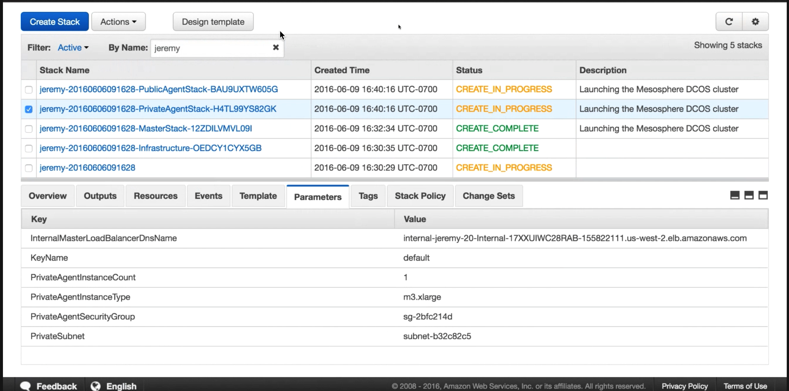
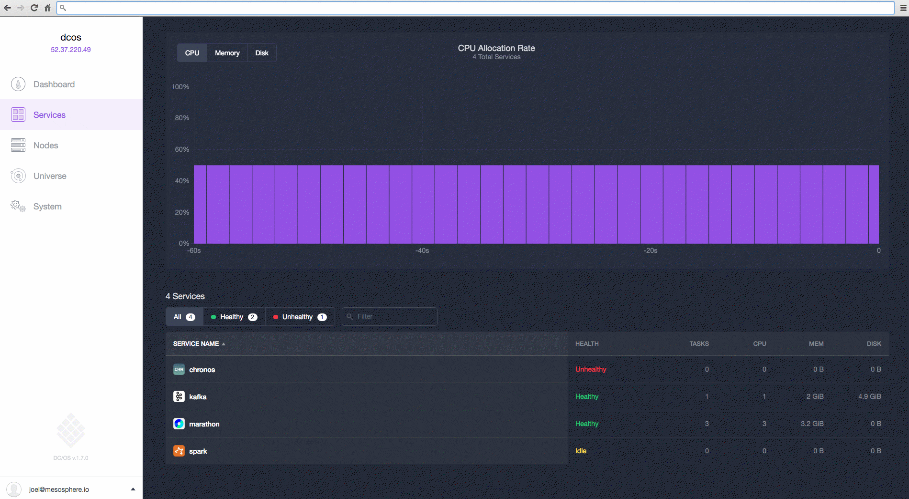
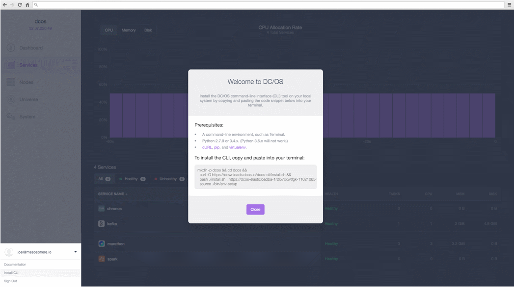

You can use a customized [Amazon Machine Images (AMI)](http://docs.aws.amazon.com/AWSEC2/latest/UserGuide/AMIs.html) to launch DC/OS instances. 

- A custom AMI can be used to integrate DC/OS installation with your own in-house configuration management tools.
- A custom AMI can be used if you want kernel or driver customization.

For an example, see the [DC/OS CentOS 7 AMI](https://github.com/dcos/dcos/tree/master/cloud_images).

**Prerequisites:**

- AWS DC/OS advanced template [system requirements](/docs/1.8/administration/installing/cloud/aws/advanced/system-requirements/).
- An AWS AMI in the same target region as your DC/OS stack. For more information about AMI regions, see the [AWS documentation](http://docs.aws.amazon.com/AWSEC2/latest/UserGuide/CopyingAMIs.html). 

 
1.  Go to [CloudFormation](https://console.aws.amazon.com/cloudformation/home) and click **Create Stack**.
1.  On the **Select Template** page, upload the DC/OS advanced templates ([zen](/docs/1.8/administration/installing/cloud/aws/advanced/template-reference/#zen), [master](/docs/1.8/administration/installing/cloud/aws/advanced/template-reference/#master), [agent](/docs/1.8/administration/installing/cloud/aws/advanced/template-reference/#private-agent)) and click **Next**.
1.  On the **Specify Details** page, specify a cluster name (`Stack name`), AMI ID (`CustomAMI`), Key Pair (`KeyName`), authentication (`OAuthEnabled`), public agent (`PublicSlaveInstanceCount`), private agent (`SlaveInstanceCount`), and click **Next**.

1.  On the **Specify Details** page, specify these values and and click **Next**.

    *  **Stack name** Specify the cluster name.
    *  **CustomAMI** Specify the AMI ID. The AMI must reside in the same region and have all DC/OS [prerequisites](/docs/1.8/administration/installing/cloud/aws/advanced/system-requirements/) installed.
    *  **InternetGateway** Specify the `InternetGatewayID` output value from the `zen.sh` script. The Internet Gateway ID must be attached to the VPC. This Internet Gateway will be used by all nodes for outgoing internet access.
    *  **KeyName** Specify your AWS EC2 Key Pair.
    *  **MasterInstanceType** Specify the Amazon EC2 instance type. The <a href="https://aws.amazon.com/ec2/pricing/" target="_blank">m3.xlarge</a> instance type is recommended.
    *  **PrivateAgentInstanceCount** Specify the number of private agents.
    *  **PrivateAgentInstanceType** Specify the Amazon EC2 instance type for the private agent nodes. The <a href="https://aws.amazon.com/ec2/pricing/" target="_blank">m3.xlarge</a> instance type is recommended.
    *  **PrivateSubnet** Specify the `Private SubnetId` output value from the `zen.sh` script. This subnet ID will be used by all private agents.
    *  **PublicAgentInstanceCount** Specify the number of public agents.
    *  **PublicAgentInstanceType** Specify the Amazon EC2 instance type for the public agent nodes. The <a href="https://aws.amazon.com/ec2/pricing/" target="_blank">m3.xlarge</a> instance type is recommended.
    *  **PublicSubnet** Specify the `Public SubnetId` output value from the `zen.sh` script. This subnet ID will be used by all public agents.
    *  **Vpc** Specify the `VpcId` output value from the `zen.sh` script. All nodes will be launched by using subnets and Internet Gateway under this VPC.

1.  On the **Options** page, accept the defaults and click **Next**.

    **Tip:** You can choose whether to rollback on failure. By default this option is set to **Yes**.

1.  On the **Review** page, check the acknowledgement box and then click **Create**.

    **Tip:** If the **Create New Stack** page is shown, either AWS is still processing your request or you’re looking at a different region. Navigate to the correct region and refresh the page to see your stack.

## Monitor the DC/OS cluster convergence process

In CloudFormation you should see:

*  The cluster stack spins up over a period of 15 to 20 minutes. You will have a stack created for each of these, where `<stack-name>` is the value you specified for **Stack name** and `<stack-id>` is an auto-generated ID.

   

   *  Zen template: `<stack-name>`
   *  Public agents: `<stack-name>-PublicAgentStack-<stack-id>`
   *  Private agents: `<stack-name>-PrivateAgentStack-<stack-id>`
   *  Masters: `<stack-name>-MasterStack-<stack-id>`
   *  Infrastructure: `<stack-name>-Infrastructure-<stack-id>`

* The status changes from `CREATE_IN_PROGRESS` to `CREATE_COMPLETE`.

**Troubleshooting:** A `ROLLBACK_COMPLETE` status means the deployment has failed. See the **Events** tab for useful information about failures.

## Launch DC/OS

Launch the DC/OS web interface by entering the master hostname:

1.  From the <a href="https://console.aws.amazon.com/cloudformation/home" target="_blank">Amazon CloudFormation Management</a> page, click to check the box next to your stack.

2.  Click on the **Outputs** tab and copy/paste the Mesos Master hostname into your browser to open the DC/OS web interface. The interface runs on the standard HTTP port 80, so you do not need to specify a port number after the hostname.

    **Tip:** You might need to resize your window to see this tab. You can find your DC/OS hostname any time from the <a href="https://console.aws.amazon.com/cloudformation/home" target="_blank">Amazon CloudFormation Management</a> page.

    

    

1.  Click the dropup menu on the lower-left side to install the DC/OS [Command-Line Interface (CLI)][2]. You must install the CLI to administer your DCOS cluster.

    
