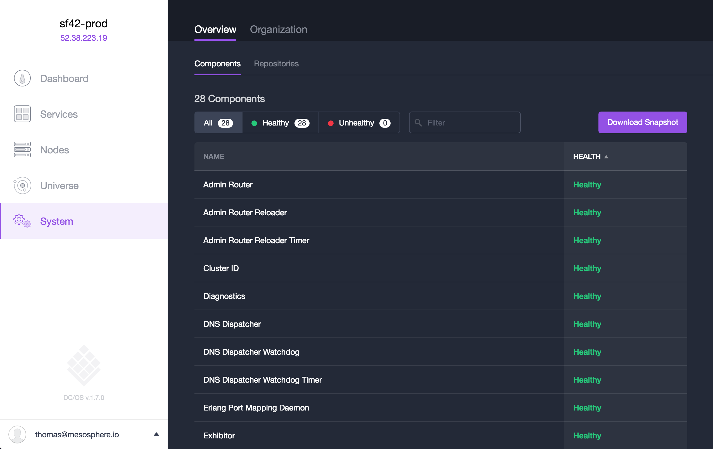
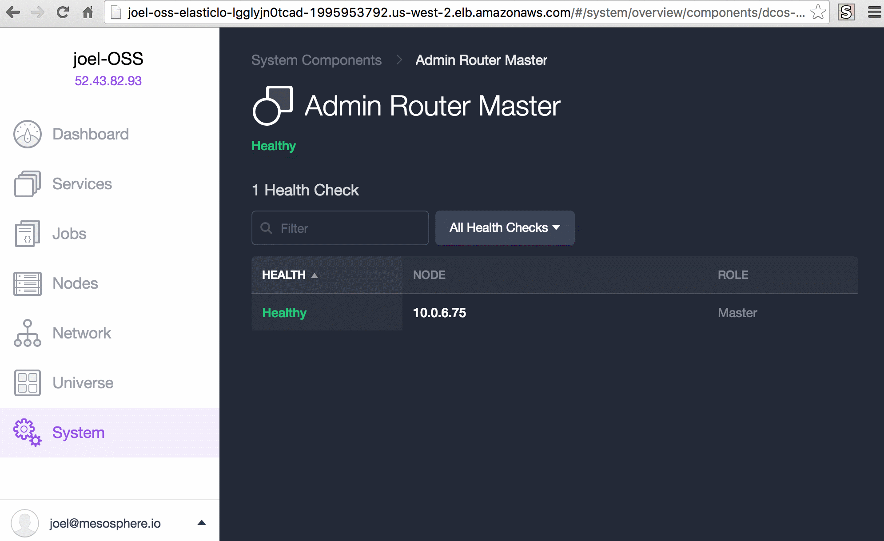

Monitoring the health of all the pieces that make up DC/OS is vital to datacenter operators and for troubleshoooting hard-to-diagnose bugs. You can monitor the health of your cluster components from the DC/OS UI component health page. The component health page displays information from the system health API, which monitors the core DC/OS components.

The component health page provides the health status of all DC/OS system components that are running in systemd. You can drill down by health status, host IP address, or specific systemd unit.

## Getting Started
When you launch the DC/OS UI, you'll see the Component Health badge in the main DC/OS UI dashboard:


You can click on the System page to go to the main system health user interface and sort by health.



When a component isn't healthy, you can drill down on it, to view the nodes where the component is running:



You can debug more by clicking the node, where you'll be able to see the unhealthy component journald (log) output:


## Health States

Possible health states are unhealthy and healthy. We infer this from codes 0 and 1.

- **Healthy** All cluster nodes are healthy. The units are loaded and not in the "active" or "inactive" state.
- **Unhealthy** One or more nodes have issues. The units are not loaded or are in the "active" or "inactive" state.

The system health API has four possible states: 0 - 3, OK; CRITICAL; WARNING; UNKNOWN. Future DC/OS iterations will leverage these codes to give more robust and detailed cluster health state information in the UI.

## System health HTTP API endpoint

The system health endpoint is exposed at port 1050:

```bash
$ curl <host_ip>:1050/system/health/v1
```

## Aggregation

Aggregation of the cluster health endpoints is accomplished by the same diagnostics application, but is only run on the master nodes. You can explore this API further by making a few queries to any master in your cluster:

```bash
$ curl <master_ip>:1050/system/health/v1/units
$ curl <master_ip>:1050/system/health/v1/nodes
$ curl <master_ip>:1050/system/health/v1/report
```

The DC/OS user interface uses these aggregation endpoints to generate the data you explore in the system health console.

## Components

What we refer to as components are in fact the [systemd units](https://www.freedesktop.org/wiki/Software/systemd/) that make up the core of the DC/OS application. These systemd 'components' are monitored by our internal diagnostics utility (dcos-diagnostics.service). This utility scans all the DC/OS units, and then exposes an HTTP API on each host.

You can query this HTTP API for any host in the cluster:

```bash
curl <host_ip>:1050/system/health/v1
```

Here is an explanation of the components shown in the UI.

### Admin Router

The Admin Router is an open-source Nginx configuration created by Mesosphere that provides central authentication and proxy to DC/OS services within the cluster.<!-- dcos-adminrouter.service/ -->

### Admin Router Reloader

Restarts the Admin Router Nginx server so that it can pick up new DNS resolutions, for example `master.mesos` and `leader.mesos`.<!-- dcos-adminrouter-reload.service/ -->

### Admin Router Reloader Timer

Sets the Admin Router Reloader interval at once per hour.<!-- dcos-adminrouter-reload.timer/ -->

### Cluster ID

A randomly generated UUID that tracks individual cluster deployments.<!-- dcos-cluster-id.service/ -->

### Diagnostics

This component informs DC/OS of individual node health for things like system resources as well as DC/OS-specific services.<!-- dcos-ddt.service/ -->

### DNS Dispatcher

The DC/OS DNS Dispatcher is an RFC5625 Compliant DNS Forwarder. It's job is to dual-dispatch DNS to multiple upstream resolvers, and to route DNS to the upstreams or Mesos DNS, depending on some rules.<!-- dcos-spartan.service/ -->

### DNS Dispatcher Watchdog

This service ensures that the DNS Dispatcher is running and healthy. If the DNS Dispatcher is unhealthy, this watchdog service kills it.<!-- dcos-spartan-watchdog.service/ -->

### DNS Dispatcher Watchdog Timer

This service wakes up the DNS Dispatcher Watchdog every 5 minutes, to see if DC/OS needs to restart DNS Dispatcher. <!-- dcos-spartan-watchdog.timer/ -->

### Erlang Port Mapping Daemon

This daemon acts as a name server on all hosts involved in distributed Erlang computations. For more information, see the [documentation](http://erlang.org/doc/man/epmd.html). <!-- dcos-epmd.service/ -->

### Exhibitor

The Exhibitor supervisor for Zookeeper. <!-- dcos-exhibitor.service/ -->

### Generate resolv.conf

This is a service that helps the agent nodes locate the master nodes.<!-- dcos-gen-resolvconf.service/ -->

### Generate resolv.conf Timer

Periodically updates the systemd-resolved for Mesos DNS.<!-- dcos-gen-resolvconf.timer/ -->

### Keepalived

Runs keepalived to make a VRRP load balancer that can be used to access the masters.<!-- dcos-keepalived.service/ -->

### Layer 4 Load Balancer
The DC/OS Layer 4 Load Balancer that enables multi-tier microservices architectures. For more information, see the [documentation](/docs/1.8/usage/service-discovery/load-balancing/).<!-- dcos-minuteman.service/ -->

### Logrotate

Logrotate allows for the automatic rotation compression, removal, and mailing of log files.<!-- dcos-logrotate.service/ -->

### Logrotate Timer

Sets the logrotate interval at 2 minutes. <!-- dcos-logrotate.timer/ -->

### Marathon

The DC/OS Marathon instance starts and monitors DC/OS applications and services.<!-- dcos-marathon.service/ -->

### Mesos Agent

The mesos-slave process for [private](/docs/1.8/overview/concepts/#private) agent nodes.<!-- dcos-mesos-slave.service/ -->

### Mesos Agent Public

The mesos-slave process for [public](/docs/1.8/overview/concepts/#public) agent nodes.<!-- dcos-mesos-slave-public.service/ -->

### Mesos DNS

Mesos DNS provides service discovery within the cluster.<!-- dcos-mesos-dns.service/ -->

### Mesos History

Enables the DC/OS web interface to display cluster usage statistics.<!-- dcos-history-service.service/ -->

### Mesos Master

The mesos-master process orchestrates agent tasks.<!-- dcos-mesos-master.service/ -->

### Mesos Persistent Volume Discovery

During DC/OS startup, this service connects to existing Mesos volume mounts on agent nodes. For more information on Mesos Persistent Volumes, see the [documentation](http://mesos.apache.org/documentation/latest/persistent-volume/). <!-- dcos-vol-discovery-pub-agent.service/ -->

### Network Metrics Aggregator

Collects statistics from the Layer 4 Load Balancer and displays them in the DC/OS Network tab.<!-- dcos-networking_api.service/ -->

### OAuth

DC/OS authorization service. <!-- dcos-oauth.service/ -->

### Package Service

This process manage the Universe package repositories. <!-- dcos-cosmos.service/ -->

### Signal

Sends a periodic ping back to Mesosphere with high-level cluster information to help improve DC/OS, and provides advanced monitoring of cluster issues.<!-- dcos-signal.service/ -->

### Signal Timer

Sets the Signal component interval at once per hour.<!-- dcos-signal.timer/ -->

## Known Issues

### Misinterpreting System Health by Unit

You can sort system health by systemd unit. However, this search can bring up misleading information as the service itself can be healthy but the node on which it runs is not. This manifests itself as a service showing "healthy" but nodes associated with that service as "unhealthy". Some people find this behavior confusing.

### Missing Cluster Hosts

The system health API relies on Mesos-DNS to know about all the cluster hosts. It finds these hosts by combining a query from `mesos.master` A records as well as `leader.mesos:5050/slaves` to get the complete list of hosts in the cluster.

This system has a known bug where an agent will not show up in the list returned from `leader.mesos:5050/slaves` if the Mesos agent service is not healthy. This means the system health API will not show this host.

If you experience this behavior it's most likely your Mesos agent service on the missing host is unhealthy.

## Troubleshooting

If you have any problems, you can check if the diagnostics service is running by SSH’ing to the Mesos leading master and checking the systemd status of the `dcos-ddt.service`.
