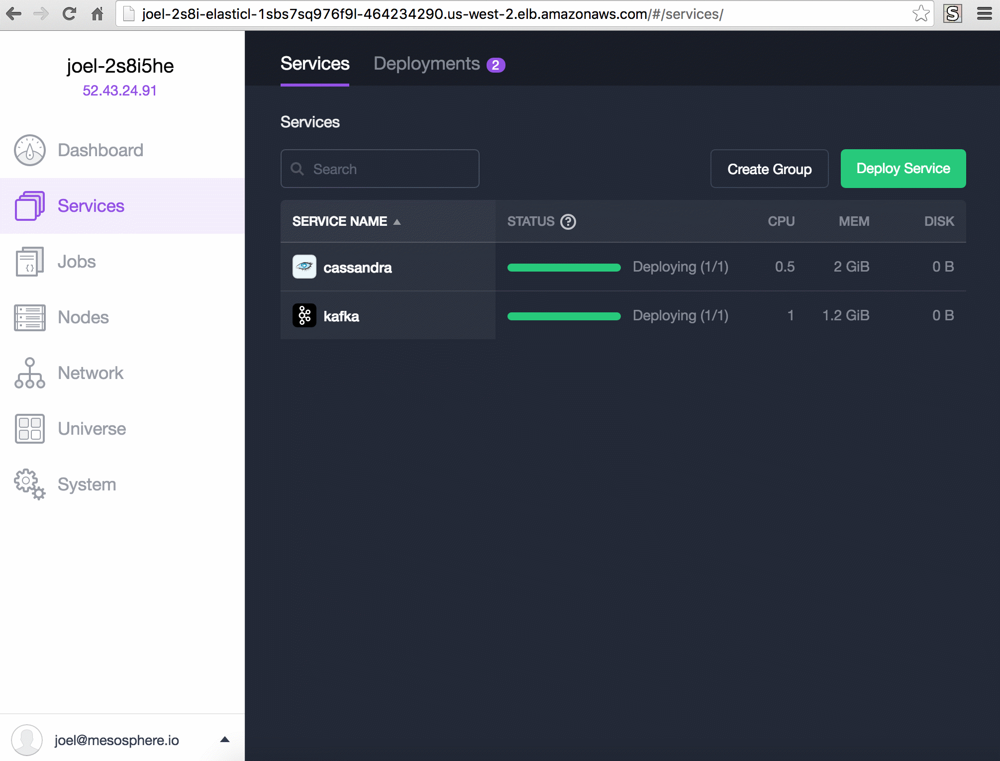

## Monitoring services using the DC/OS CLI

From the DC/OS CLI, enter the `dcos service` command. In this example you can see the native Marathon instance and the installed DC/OS services Chronos, HDFS, and Kafka.

```bash
$ dcos service
NAME      HOST             ACTIVE  TASKS CPU   MEM     DISK   ID
chronos   <privatenode1>   True     0    0.0    0.0     0.0   <service-id1>
hdfs      <privatenode2>   True     1    0.35  1036.8   0.0   <service-id2>
kafka     <privatenode3>   True     0    0.0    0.0     0.0   <service-id3>
marathon  <privatenode3>   True     3    2.0   1843.0  100.0  <service-id4>
```

## Monitoring services using the DC/OS web interface

From the DC/OS web interface, click the [**Services**](/docs/1.8/usage/webinterface/#services) tab. 

