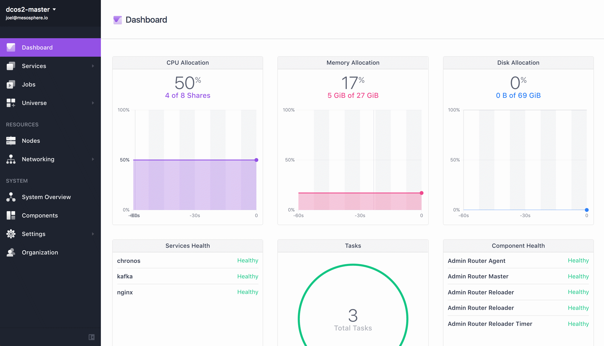
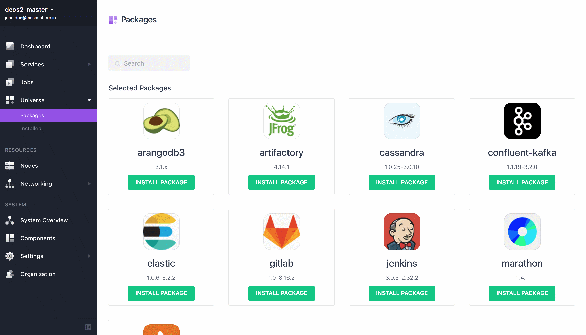
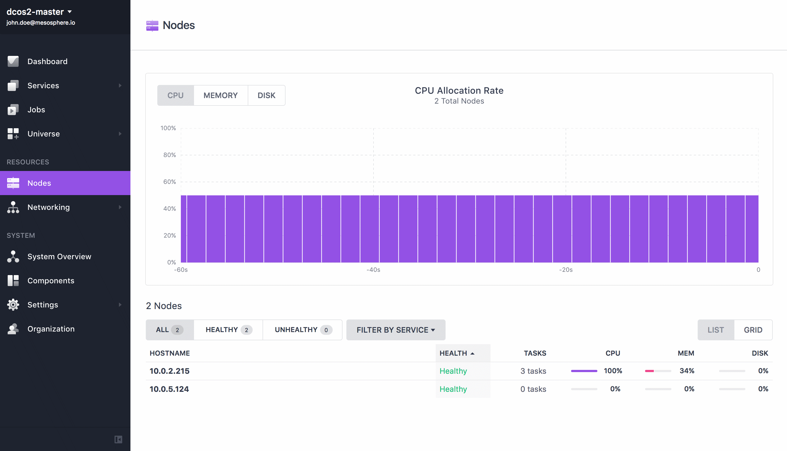
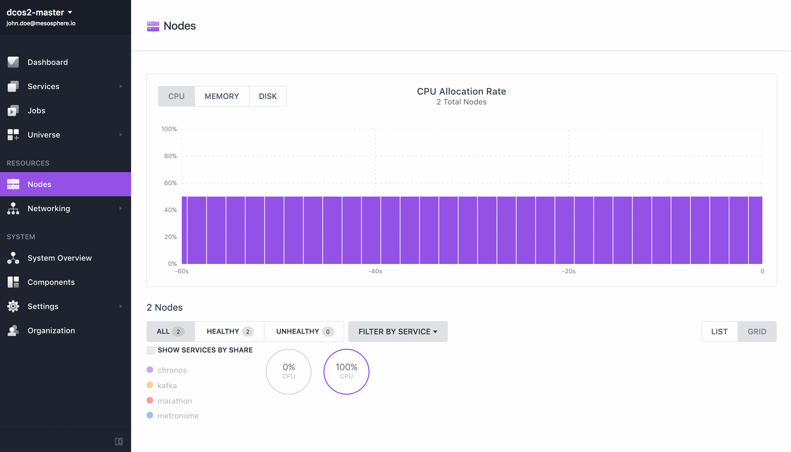
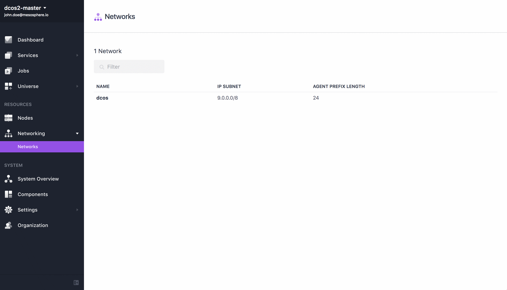

The DC/OS web interface provides a rich graphical view of your DC/OS cluster. With the web interface you can view the current state of your entire cluster and DC/OS services. The web interface is installed as a part of your DC/OS installation.

Additionally, there is a User Menu on the upper-left side of the web interface that includes links for documentation, CLI installation, and user sign out.

# Dashboard

The dashboard is the home page of the DC/OS web interface and provides an overview of your DC/OS cluster.

From the dashboard you can easily monitor the health of your cluster.

*   The CPU Allocation panel provides a graph of the current percentage of available general compute units that are being used by your cluster.

*   The Memory Allocation panel provides a graph of the current percentage of available memory that is being used by your cluster.

*   The Task Failure Rate panel provides a graph of the current percentage of tasks that are failing in your cluster.

*   The Services Health panel provides an overview of the health of your services. Each service provides a health check, run at intervals. This indicator shows the current status according to that health check. A maximum of 5 services are displayed, sorted by priority of the most unhealthy. You can click the View all Services button for detailed information and a complete list of your services.

*   The Tasks panel provides the current number of tasks that are staged and running.

*   The Nodes panel provides a view of the nodes in your cluster.

# Services

The Services tab provides a full-featured interface to the native DC/OS Marathon instance. This Services tab provides a comprehensive view of all of the services that you are running. You can view a graph that shows the allocation percentage rate for CPU, memory, or disk. You can filter services by health status or service name.

By default all of your services are displayed, sorted by service name. You can also sort the services by health status, number of tasks, CPU, memory, or disk space allocated.

*   **SERVICE NAME** Displays the DC/OS service name.
*   **HEALTH** Displays the [Marathon health check][3] status for the service.
*   **TASKS** Display the number of running tasks.
*   **CPU** Displays the percentage of CPU in use.
*   **MEM** Displays the amount of memory used.
*   **DISK** Displays the amount of disk space used.

Clicking the service name opens the Services side panel, which provides CPU, memory, and disk usage graphs and lists all tasks using the service. Use the dropdown or a custom filter to sort tasks and click on details for more information. For services with a web interface, you can click **Open Service** to view it. Click on a task listed on the Services side panel to see detailed information about the task’s CPU, memory, and disk usage and the task’s files and directory tree.

**Tip:** You can access the Mesos web interface at `<hostname>/mesos`.

# Jobs

The Jobs tab provides native support for creating and administering scheduled jobs. You can set up jobs with a schedule in cron format. For more information, see the [documentation](/docs/1.9/usage/jobs/).

# Universe

The Universe tab shows all of the available DC/OS services from package [repositories](/docs/1.9/usage/repo/). You can install packages from the DC/OS Universe with a single click. The packages can be installed with defaults or customized directly in the web interface.

# Nodes

The Nodes tab provides a comprehensive view of all of the nodes that are used across your cluster. You can view a graph that shows the allocation percentage rate for CPU, memory, or disk.

By default all of your nodes are displayed in **List** view, sorted by hostname. You can filter nodes by service type or hostname. You can also sort the nodes by number of tasks or percentage of CPU, memory, or disk space allocated.

You can switch to **Grid** view to see a "donuts" percentage visualization.

Clicking on a node opens the Nodes side panel, which provides CPU, memory, and disk usage graphs and lists all tasks on the node. Use the dropdown or a custom filter to sort tasks and click on details for more information. Click on a task listed on the Nodes side panel to see detailed information about the task’s CPU, memory, and disk usage and the task’s files and directory tree.

# Networking

The Network tab provides information for troubleshooting your virtual networks. You can see which containers are on which network and see their IP addresses. For more information, see the [documentation](/docs/1.9/administration/virtual-networks/ip-per-container/).

# System Overview
View the cluster details from the **System Overview** tab.

# Components
View the system health of your DC/OS components from the **Components** tab.

# Settings
Manage your DC/OS package repositories from the **Settings** tab.

# Organization
Manage user access from the **Organization** tab.

[3]: https://mesosphere.github.io/marathon/docs/health-checks.html
